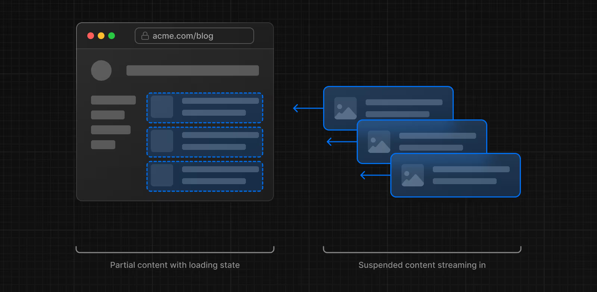

# Kısmi Önceden Oluşturma (Partial Prerendering)

Bu özellik şu anda **deneyseldir** ve değişebilir, bu nedenle **prodüksiyonda kullanılması önerilmez**. Denemek için uygulayabilir ve geri bildirimlerinizi GitHub üzerinden paylaşabilirsiniz.

**Kısmi Önceden Oluşturma (PPR)**, aynı rotada statik ve dinamik içeriği birleştirmenizi sağlayan bir işleme stratejisidir. Bu yaklaşım, kişiselleştirilmiş ve dinamik verileri desteklerken ilk sayfa performansını iyileştirir.


# Kısmi Önceden Oluşturma Nasıl Çalışır?

Bir kullanıcı bir rotayı ziyaret ettiğinde:

* Sunucu, hızlı bir ilk yükleme sağlamak için statik içeriği içeren bir **kabuk (shell)** gönderir.
* Bu kabuk, asenkron olarak yüklenecek **dinamik içerikler için boşluklar** bırakır.
* Dinamik boşluklar paralel olarak aktarılır (**streaming**), böylece sayfanın toplam yüklenme süresi azalır.

---

## Next.js’te Kısmi Önceden Oluşturmayı Anlamak

Kısmi Önceden Oluşturmayı kavramak için Next.js’te mevcut işleme (rendering) stratejilerine aşina olmak faydalıdır.

### Statik İşleme (Static Rendering)

Statik işlemeyle HTML, önceden oluşturulur:

* ya **build sırasında**
* ya da **yeniden doğrulama (revalidation)** yoluyla.

Sonuç, önbelleğe alınır ve tüm kullanıcılar ve istekler arasında paylaşılır.

➡️ Kısmi Önceden Oluşturmada, Next.js rota için **statik bir kabuk** oluşturur. Bu kabuk, layout’u ve istek zamanındaki veriye ihtiyaç duymayan diğer bileşenleri içerebilir.

---

### Dinamik İşleme (Dynamic Rendering)

Dinamik işlemeyle HTML, **istek anında** oluşturulur. Bu yöntem, istek anındaki verilere göre kişiselleştirilmiş içerik sunmayı mümkün kılar.

Bir bileşen, aşağıdaki API’leri kullanıyorsa **dinamik** hale gelir:

* `cookies`
* `headers`
* `connection`
* `draftMode`
* `searchParams` prop’u
* `unstable_noStore`
* `fetch` ile `{ cache: 'no-store' }`

➡️ Kısmi Önceden Oluşturmada bu API’lerin kullanılması, Next.js’e bileşenin statik olarak işlenemeyeceğini bildiren özel bir **React hatası** fırlatır ve build hatasına neden olur.
Bu durumda, bileşeni **Suspense** boundary’si içine alarak işlenmeyi çalışma zamanına erteleyebilirsiniz.

---

### Suspense

**React Suspense**, uygulamanızın bazı kısımlarının işlenmesini belirli bir koşul karşılanana kadar ertelemenize olanak tanır.

➡️ Kısmi Önceden Oluşturmada, Suspense bileşen ağacınızdaki dinamik sınırları işaretlemek için kullanılır.

* **Build sırasında**, Next.js statik içeriği ve fallback UI’yı önceden oluşturur.
* **Dinamik içerik**, kullanıcı rotayı talep ettiğinde işlenir.

⚠️ Bir bileşeni Suspense ile sarmak onu otomatik olarak dinamik yapmaz. Dinamikliği, kullandığınız API belirler. Suspense yalnızca dinamik içeriği kapsülleyen ve akışı (streaming) etkinleştiren bir sınırdır.

#### Örnek:

```js
// app/page.js
import { Suspense } from 'react'
import StaticComponent from './StaticComponent'
import DynamicComponent from './DynamicComponent'
import Fallback from './Fallback'
 
export const experimental_ppr = true
 
export default function Page() {
  return (
    <>
      <StaticComponent />
      <Suspense fallback={<Fallback />}>
        <DynamicComponent />
      </Suspense>
    </>
  )
}
```

---

### Streaming

**Streaming**, rotayı parçalara böler ve bu parçaları hazır oldukça istemciye kademeli olarak gönderir.

Bu sayede kullanıcı, tüm içerik işlenmeden önce sayfanın bazı kısımlarını hemen görebilir.




Kısmi Önceden Oluşturmada, **Suspense ile sarılmış dinamik bileşenler sunucudan paralel olarak akışa (streaming) başlar.**


# Kısmi Önceden Oluşturmayı Etkinleştirme

Ağ yükünü azaltmak için, statik HTML ve akışla gönderilen dinamik kısımlar da dahil olmak üzere tam yanıt tek bir **HTTP isteği** ile gönderilir. Bu yaklaşım ekstra istekleri önler ve hem ilk yüklemeyi hem de genel performansı iyileştirir.

---

## PPR’yi Etkinleştirme

`next.config.ts` dosyanıza `ppr` seçeneğini ekleyerek Kısmi Önceden Oluşturmayı etkinleştirebilirsiniz:

```ts
// next.config.ts
import type { NextConfig } from 'next'
 
const nextConfig: NextConfig = {
  experimental: {
    ppr: 'incremental',
  },
}
 
export default nextConfig
```

`'incremental'` değeri, PPR’yi belirli rotalar için aşamalı olarak kullanmanıza olanak tanır:

```ts
// app/dashboard/layout.tsx
export const experimental_ppr = true
 
export default function Layout({ children }: { children: React.ReactNode }) {
  // ...
}
```

➡️ `experimental_ppr` eklenmeyen rotalar varsayılan olarak `false` değerini alır ve PPR ile önceden oluşturulmaz. Her rota için **açıkça etkinleştirme** yapmanız gerekir.

---

## Bilmeniz İyi Olur

* `experimental_ppr`, rota segmentinin tüm alt öğelerine (nested layout’lar ve sayfalar dahil) uygulanır. Yalnızca rotanın en üst segmentine eklemeniz yeterlidir.
* Alt segmentler için PPR’yi devre dışı bırakmak isterseniz, `experimental_ppr` değerini `false` olarak ayarlayabilirsiniz.

---

## Örnekler

### Dinamik API’ler

İstek sırasında gelen verilere bakmayı gerektiren Dinamik API’ler kullanıldığında, Next.js rotayı **dinamik işleme**ye geçirir. PPR kullanmaya devam etmek için bileşeni **Suspense** ile sarmalayabilirsiniz.

Örneğin, `<User />` bileşeni `cookies` API’sini kullandığı için dinamiktir:

```ts
// app/user.tsx
import { cookies } from 'next/headers'
 
export async function User() {
  const session = (await cookies()).get('session')?.value
  return '...'
}
```

`<User />` bileşeni akışla gönderilirken, `<Page />` içindeki diğer içerikler önceden oluşturulur ve statik kabuğun parçası olur.

```ts
// app/page.tsx
import { Suspense } from 'react'
import { User, AvatarSkeleton } from './user'
 
export const experimental_ppr = true
 
export default function Page() {
  return (
    <section>
      <h1>This will be prerendered</h1>
      <Suspense fallback={<AvatarSkeleton />}>
        <User />
      </Suspense>
    </section>
  )
}
```

---

### Dinamik Props Geçirme

Bileşenler yalnızca **değere erişildiğinde** dinamik hale gelir.
Örneğin, `<Page />` bileşeninde `searchParams` değerini okuyor ve bunu başka bir bileşene prop olarak iletiyorsanız:

```ts
// app/page.tsx
import { Table, TableSkeleton } from './table'
import { Suspense } from 'react'
 
export default function Page({
  searchParams,
}: {
  searchParams: Promise<{ sort: string }>
}) {
  return (
    <section>
      <h1>This will be prerendered</h1>
      <Suspense fallback={<TableSkeleton />}>
        <Table searchParams={searchParams} />
      </Suspense>
    </section>
  )
}
```

`table` bileşeni içinde `searchParams` değerine erişmek, bileşeni dinamik hale getirir. Ancak sayfanın geri kalanı **önceden oluşturulmuş** olur.

```ts
// app/table.tsx
export async function Table({
  searchParams,
}: {
  searchParams: Promise<{ sort: string }>
}) {
  const sort = (await searchParams).sort === 'true'
  return '...'
}
```

---

## Sonraki Adımlar

* **[ppr](#)** konfigürasyon seçeneği hakkında daha fazla bilgi edinin.
* Next.js’te Kısmi Önceden Oluşturmayı etkinleştirmeyi öğrenin.
