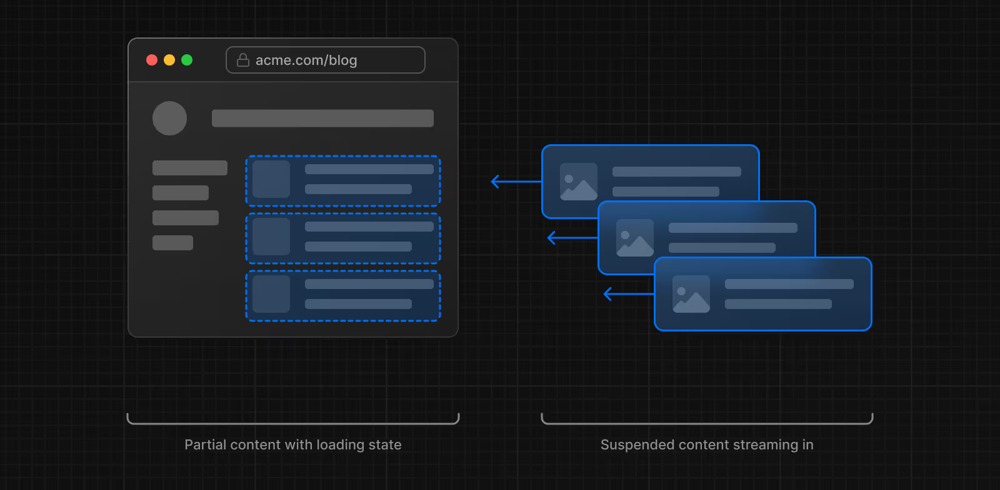
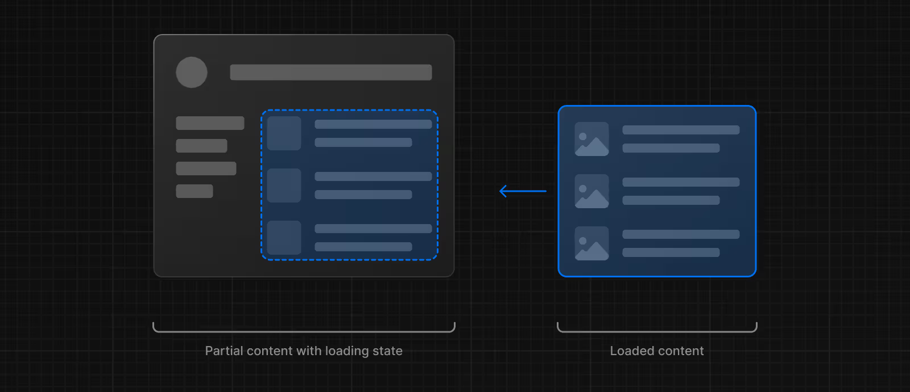
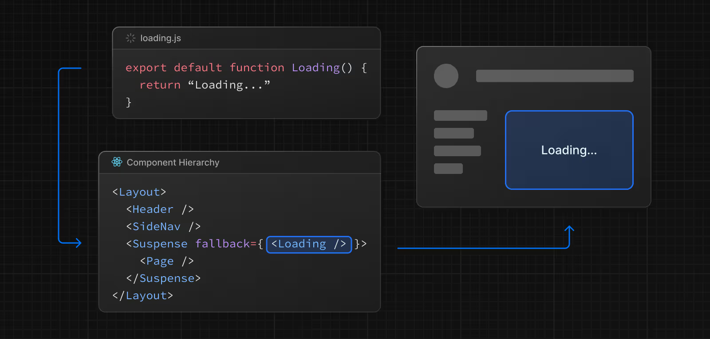
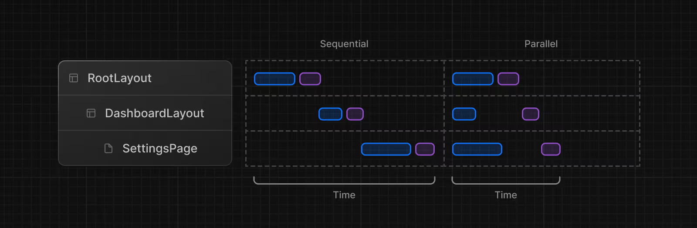

# Veri Çekme

Bu sayfa, Sunucu ve İstemci Bileşenlerinde nasıl veri çekebileceğinizi ve veriye bağlı bileşenleri nasıl stream edebileceğinizi anlatır.

## Veri Çekme

### Sunucu Bileşenleri

Sunucu Bileşenlerinde veri çekmek için şunları kullanabilirsiniz:

* `fetch` API’si
* Bir ORM veya veritabanı

#### `fetch` API’si ile

`fetch` API’si ile veri çekmek için bileşeninizi asenkron bir fonksiyona çevirin ve `fetch` çağrısını `await` edin. Örneğin:

```tsx
// app/blog/page.tsx
export default async function Page() {
  const data = await fetch('https://api.vercel.app/blog')
  const posts = await data.json()
  return (
    <ul>
      {posts.map((post) => (
        <li key={post.id}>{post.title}</li>
      ))}
    </ul>
  )
}
```

**Bilmeniz gerekenler:**

* `fetch` yanıtları varsayılan olarak önbelleğe alınmaz. Ancak, Next.js rotayı önceden oluşturur ve çıktıyı daha iyi performans için önbelleğe alır. Dinamik render’a geçmek için `{ cache: 'no-store' }` seçeneğini kullanın. Bkz. [fetch API Referansı].
* Geliştirme sırasında, daha iyi görünürlük ve hata ayıklama için `fetch` çağrılarını loglayabilirsiniz. Bkz. [logging API referansı].

#### ORM veya veritabanı ile

Sunucu Bileşenleri sunucuda render edildiğinden, ORM veya veritabanı istemcisi kullanarak güvenli bir şekilde sorgular yapabilirsiniz. Bileşeninizi asenkron fonksiyona çevirin ve çağrıyı `await` edin:

```tsx
// app/blog/page.tsx
import { db, posts } from '@/lib/db'
 
export default async function Page() {
  const allPosts = await db.select().from(posts)
  return (
    <ul>
      {allPosts.map((post) => (
        <li key={post.id}>{post.title}</li>
      ))}
    </ul>
  )
}
```

---

### İstemci Bileşenleri

İstemci Bileşenlerinde veri çekmenin iki yolu vardır:

* React’in `use` hook’u
* SWR veya React Query gibi topluluk kütüphaneleri

#### `use` hook ile veri stream etme

React’in `use` hook’unu kullanarak veriyi sunucudan istemciye stream edebilirsiniz. Önce, veriyi Sunucu Bileşeninde fetch edin ve promise’i bir prop olarak İstemci Bileşenine gönderin:

```tsx
// app/blog/page.tsx
import Posts from '@/app/ui/posts'
import { Suspense } from 'react'
 
export default function Page() {
  // Veri çekme fonksiyonunu await etmeyin
  const posts = getPosts()
 
  return (
    <Suspense fallback={<div>Loading...</div>}>
      <Posts posts={posts} />
    </Suspense>
  )
}
```

Sonra, İstemci Bileşeninde `use` hook’u ile promise’i okuyun:

```tsx
// app/ui/posts.tsx
'use client'
import { use } from 'react'
 
export default function Posts({
  posts,
}: {
  posts: Promise<{ id: string; title: string }[]>
}) {
  const allPosts = use(posts)
 
  return (
    <ul>
      {allPosts.map((post) => (
        <li key={post.id}>{post.title}</li>
      ))}
    </ul>
  )
}
```

Yukarıdaki örnekte, `<Posts>` bileşeni bir `<Suspense>` boundary içinde sarılıdır. Bu, promise çözülene kadar fallback’in gösterileceği anlamına gelir. Daha fazla bilgi için [streaming] konusuna bakın.

---

#### Topluluk kütüphaneleri

İstemci Bileşenlerinde veri çekmek için SWR veya React Query gibi kütüphaneleri kullanabilirsiniz. Bu kütüphaneler kendi önbellekleme, streaming ve diğer özellik semantiklerine sahiptir. Örneğin SWR ile:

```tsx
// app/blog/page.tsx
'use client'
import useSWR from 'swr'
 
const fetcher = (url) => fetch(url).then((r) => r.json())
 
export default function BlogPage() {
  const { data, error, isLoading } = useSWR(
    'https://api.vercel.app/blog',
    fetcher
  )
 
  if (isLoading) return <div>Loading...</div>
  if (error) return <div>Error: {error.message}</div>
 
  return (
    <ul>
      {data.map((post: { id: string; title: string }) => (
        <li key={post.id}>{post.title}</li>
      ))}
    </ul>
  )
}
```

---

## İstekleri Tekrarlamayı Önleme ve Veriyi Önbelleğe Alma

İstekleri tekrarlamayı önlemenin bir yolu **istek memoization** kullanmaktır. Bu mekanizmada, aynı URL ve seçeneklerle yapılan `GET` veya `HEAD` `fetch` çağrıları tek bir render geçişinde birleştirilir. Bu işlem otomatik yapılır; `fetch`’e bir `Abort` sinyali göndererek devre dışı bırakabilirsiniz.

İstek memoization, bir isteğin ömrüyle sınırlıdır.

İstekleri tekrarlamayı önlemenin başka bir yolu da Next.js’in **Data Cache** özelliğini kullanmaktır. Örneğin `fetch` seçeneklerinde `cache: 'force-cache'` ayarlayabilirsiniz.

Data Cache, verinin mevcut render geçişi ve gelen istekler arasında paylaşılmasına izin verir.

`fetch` kullanmıyorsanız ve doğrudan ORM veya veritabanı kullanıyorsanız, veri erişiminizi React’in `cache` fonksiyonu ile sarmalayabilirsiniz:

```tsx
// app/lib/data.ts
import { cache } from 'react'
import { db, posts, eq } from '@/lib/db'
 
export const getPost = cache(async (id: string) => {
  const post = await db.query.posts.findFirst({
    where: eq(posts.id, parseInt(id)),
  })
})
```

---

## Streaming

⚠️ **Uyarı:** Aşağıdaki içerik, uygulamanızda `cacheComponents` yapılandırma seçeneğinin etkin olduğunu varsayar. Bu bayrak, Next.js 15 canary sürümünde tanıtıldı.

Sunucu Bileşenlerinde `async/await` kullanıldığında, Next.js dinamik render’a geçer. Bu, verinin her kullanıcı isteğinde sunucuda fetch edilip render edileceği anlamına gelir. Eğer yavaş veri istekleri varsa, tüm rota render edilmekten bloke olur.

Başlangıç yükleme süresini ve kullanıcı deneyimini iyileştirmek için streaming kullanabilirsiniz. Bu yöntem, sayfanın HTML’ini daha küçük parçalara bölerek bu parçaların sunucudan istemciye kademeli olarak gönderilmesini sağlar.




## Streaming Uygulamanın İki Yolu

Uygulamanızda streaming’i iki şekilde uygulayabilirsiniz:

* Bir sayfayı `loading.js` dosyası ile sarmalayarak
* Bir bileşeni `<Suspense>` ile sarmalayarak

---

### `loading.js` ile

Veri fetch edilirken tüm sayfayı stream edebilmek için, sayfanızla aynı klasörde bir `loading.js` dosyası oluşturabilirsiniz.

Örneğin, `app/blog/page.js` sayfasını stream etmek için, `app/blog` klasörünün içine bir `loading.js` dosyası ekleyin.


```tsx
// app/blog/loading.tsx
export default function Loading() {
  // Burada Yükleniyor arayüzünü tanımlayın
  return <div>Loading...</div>
}
```

Gezinme sırasında, kullanıcı sayfa render edilirken anında yerleşimi ve bir **yükleniyor durumu** görür. Render işlemi tamamlandığında ise yeni içerik otomatik olarak yer değiştirir.




Arka planda, `loading.js` dosyası `layout.js` içerisine yerleştirilir ve otomatik olarak `page.js` dosyasını ve onun altındaki tüm çocukları bir `<Suspense>` boundary içerisine sarar.




## Daha Granüler Streaming için `<Suspense>`

`loading.js` yaklaşımı rota segmentleri (layout’lar ve sayfalar) için iyi çalışır, ancak daha ince kontrol için `<Suspense>` kullanabilirsiniz.

### `<Suspense>` ile

`<Suspense>`, sayfanın hangi bölümlerinin stream edileceğini daha granüler biçimde belirlemenize olanak tanır. Örneğin, `<Suspense>` boundary’nin dışındaki içerik hemen kullanıcıya gösterilirken, boundary içindeki blog yazıları listesi stream edilir.

```tsx
// app/blog/page.tsx
import { Suspense } from 'react'
import BlogList from '@/components/BlogList'
import BlogListSkeleton from '@/components/BlogListSkeleton'
 
export default function BlogPage() {
  return (
    <div>
      {/* Bu içerik istemciye anında gönderilecektir */}
      <header>
        <h1>Welcome to the Blog</h1>
        <p>Read the latest posts below.</p>
      </header>
      <main>
        {/* <Suspense> boundary içine sarılan içerik stream edilecektir */}
        <Suspense fallback={<BlogListSkeleton />}>
          <BlogList />
        </Suspense>
      </main>
    </div>
  )
}
```

---

## Anlamlı Yüklenme Durumları Oluşturma

**Anında yüklenme durumu**, gezinmeden hemen sonra kullanıcıya gösterilen fallback arayüzdür. En iyi kullanıcı deneyimi için, uygulamanın yanıt verdiğini anlamalarını sağlayacak **anlamlı yüklenme durumları** tasarlamanız önerilir.

Buna örnek olarak:

* **Skeleton ekranları**
* **Spinners (yükleniyor animasyonları)**
* Gelecek ekranların küçük ama anlamlı bir parçası (örneğin kapak fotoğrafı, başlık vb.)

---

## Geliştirmede

Geliştirme sırasında, bileşenlerinizin yüklenme durumunu **React DevTools** kullanarak önizleyebilir ve inceleyebilirsiniz.

---

## Örnekler

### Ardışık (Sequential) Veri Çekme

Ardışık veri çekme, bir bileşen ağacında iç içe geçmiş bileşenlerin her birinin kendi verisini çekmesi ve bu isteklerin tekrarlanmaması (deduplication yapılmaması) durumunda gerçekleşir. Bu da daha uzun yanıt sürelerine yol açar.




## Ardışık (Sequential) Veri Çekme

Bazı durumlarda bu deseni tercih etmek isteyebilirsiniz çünkü bir fetch işlemi diğerinin sonucuna bağlı olabilir.

Örneğin, `<Playlists>` bileşeni, yalnızca `<Artist>` bileşeni veriyi aldıktan sonra fetch işlemine başlar çünkü `<Playlists>` `artistID` prop’una bağımlıdır:

```tsx
// app/artist/[username]/page.tsx
export default async function Page({
  params,
}: {
  params: Promise<{ username: string }>
}) {
  const { username } = await params
  // Sanatçı bilgisini al
  const artist = await getArtist(username)
 
  return (
    <>
      <h1>{artist.name}</h1>
      {/* Playlists bileşeni yüklenirken fallback UI göster */}
      <Suspense fallback={<div>Loading...</div>}>
        {/* Playlists bileşenine artist ID gönder */}
        <Playlists artistID={artist.id} />
      </Suspense>
    </>
  )
}
 
async function Playlists({ artistID }: { artistID: string }) {
  // Sanatçı ID’sini kullanarak playlistleri al
  const playlists = await getArtistPlaylists(artistID)
 
  return (
    <ul>
      {playlists.map((playlist) => (
        <li key={playlist.id}>{playlist.name}</li>
      ))}
    </ul>
  )
}
```

Kullanıcı deneyimini iyileştirmek için React `<Suspense>` kullanarak fallback göstermelisiniz. Bu, streaming’i etkinleştirir ve tüm rotanın ardışık veri istekleri tarafından bloke edilmesini engeller.

---

## Paralel (Parallel) Veri Çekme

Paralel veri çekme, bir rotadaki veri isteklerinin aynı anda başlatılması durumunda gerçekleşir.

Varsayılan olarak, layout’lar ve sayfalar **paralel** render edilir. Böylece her segment veriyi mümkün olan en erken anda çekmeye başlar.

Ancak bir bileşen içinde, asenkron istekler arka arkaya (`await`) yazılırsa yine de ardışık çalışır. Örneğin, aşağıda `getAlbums`, `getArtist` bitene kadar bloke edilir:

```tsx
// app/artist/[username]/page.tsx
import { getArtist, getAlbums } from '@/app/lib/data'
 
export default async function Page({ params }) {
  // Bu istekler ardışık olacaktır
  const { username } = await params
  const artist = await getArtist(username)
  const albums = await getAlbums(username)
  return <div>{artist.name}</div>
}
```

İstekleri **paralel** başlatmak için, onları kullanan bileşenin dışında tanımlayabilir ve `Promise.all` ile aynı anda çözebilirsiniz:

```tsx
// app/artist/[username]/page.tsx
import Albums from './albums'
 
async function getArtist(username: string) {
  const res = await fetch(`https://api.example.com/artist/${username}`)
  return res.json()
}
 
async function getAlbums(username: string) {
  const res = await fetch(`https://api.example.com/artist/${username}/albums`)
  return res.json()
}
 
export default async function Page({
  params,
}: {
  params: Promise<{ username: string }>
}) {
  const { username } = await params
  const artistData = getArtist(username)
  const albumsData = getAlbums(username)
 
  // İki isteği paralel başlat
  const [artist, albums] = await Promise.all([artistData, albumsData])
 
  return (
    <>
      <h1>{artist.name}</h1>
      <Albums list={albums} />
    </>
  )
}
```

**Bilmeniz gerekenler:** Eğer `Promise.all` içindeki isteklerden biri başarısız olursa, tüm işlem başarısız olur. Bunun yerine hataları yönetmek için `Promise.allSettled` kullanabilirsiniz.

---

## Veri Önyükleme (Preloading)

Veriyi önyüklemek için, bloklayan isteklerden **önce** çağrılan bir yardımcı fonksiyon oluşturabilirsiniz.

`<Item>` bileşeni, `checkIsAvailable()` fonksiyonuna göre koşullu render edilir. `checkIsAvailable()` çağrılmadan önce `preload()` kullanarak `<Item>` bileşeninin veri bağımlılıklarını erkenden başlatabilirsiniz. Böylece `<Item>` render edildiğinde verisi hazır olur.

```tsx
// app/item/[id]/page.tsx
import { getItem, checkIsAvailable } from '@/lib/data'
 
export default async function Page({
  params,
}: {
  params: Promise<{ id: string }>
}) {
  const { id } = await params
  // item verisini yüklemeye başla
  preload(id)
  // başka bir asenkron işlemi gerçekleştir
  const isAvailable = await checkIsAvailable()
 
  return isAvailable ? <Item id={id} /> : null
}
 
export const preload = (id: string) => {
  // void ifadesi verilen ifadeyi çalıştırır ve undefined döner
  // https://developer.mozilla.org/docs/Web/JavaScript/Reference/Operators/void
  void getItem(id)
}
 
export async function Item({ id }: { id: string }) {
  const result = await getItem(id)
  // ...
}
```

Ek olarak, React’in `cache` fonksiyonu ve `server-only` paketini kullanarak tekrar kullanılabilir yardımcı fonksiyonlar oluşturabilirsiniz. Bu yöntem, veri çekme fonksiyonunu önbelleğe almanıza ve yalnızca sunucuda çalıştırılmasını sağlamanıza izin verir.

```tsx
// utils/get-item.ts
import { cache } from 'react'
import 'server-only'
import { getItem } from '@/lib/data'
 
export const preload = (id: string) => {
  void getItem(id)
}
 
export const getItem = cache(async (id: string) => {
  // ...
})
```

---

## API Referansı

Bu sayfada bahsedilen özellikler hakkında daha fazla bilgi için API Referanslarını inceleyin:

* **Data Security**: Next.js’in yerleşik veri güvenliği özellikleri ve en iyi uygulamalar.
* **fetch**: Genişletilmiş `fetch` fonksiyonu için API referansı.
* **loading.js**: `loading.js` dosyası için API referansı.
* **logging**: Geliştirme modunda veri fetch işlemlerinin konsola loglanmasını yapılandırma.
* **taint**: Nesneler ve değerler üzerinde tainting özelliğini etkinleştirme.

