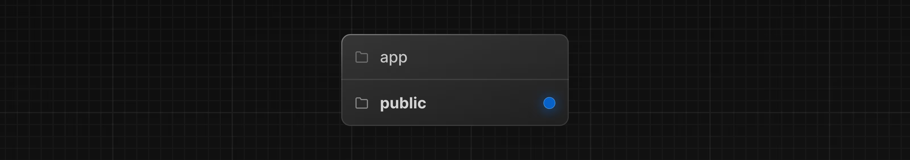

# Görsel Optimizasyonu

Next.js `<Image>` bileşeni, HTML `` etiketini genişleterek şu avantajları sağlar:

* **Boyut optimizasyonu**: Her cihaz için otomatik olarak doğru boyutta görseller sunar, WebP gibi modern görsel formatlarını kullanır.
* **Görsel stabilite**: Görseller yüklenirken otomatik olarak düzen kaymasını engeller.
* **Daha hızlı sayfa yüklenmesi**: Görselleri yalnızca görünüm alanına girdiklerinde yükler, yerel tarayıcı lazy loading kullanır, isteğe bağlı olarak blur-up placeholder desteği sunar.
* **Varlık esnekliği**: İhtiyaca göre görselleri yeniden boyutlandırabilir, uzak sunucularda saklanan görselleri bile işleyebilir.

`<Image>` bileşenini kullanmaya başlamak için `next/image` modülünden import edip bileşeninizin içine eklemeniz gerekir:

```tsx
// app/page.tsx
import Image from 'next/image'
 
export default function Page() {
  return <Image src="" alt="" />
}
```

`src` özelliği yerel veya uzak bir görsel olabilir.

🎥 İzle: [next/image kullanımı hakkında daha fazla bilgi edinin → YouTube (9 dakika)]

---

## Yerel görseller

Statik dosyalarınızı (ör. görseller, fontlar) proje kök dizininde `public` klasörü altında saklayabilirsiniz. `public` içindeki dosyalar, kodunuzda taban URL (`/`) üzerinden referans alınabilir.





# Görsel Kullanımı

## Yerel Görseller

Bir görseli **yerel olarak** kullanmak için `public` klasöründen referans verebilirsiniz:

```tsx
// app/page.tsx
import Image from 'next/image'
 
export default function Page() {
  return (
    <Image
      src="/profile.png"
      alt="Yazarın resmi"
      width={500}
      height={500}
    />
  )
}
```

Eğer görsel **statik olarak import edilirse**, Next.js otomatik olarak görselin **intrinsic width** ve **height** değerlerini belirler. Bu değerler, görsel oranını hesaplamak ve yükleme sırasında **Cumulative Layout Shift (CLS)** oluşmasını engellemek için kullanılır:

```tsx
// app/page.tsx
import Image from 'next/image'
import ProfileImage from './profile.png'
 
export default function Page() {
  return (
    <Image
      src={ProfileImage}
      alt="Yazarın resmi"
      // width={500} otomatik sağlanır
      // height={500} otomatik sağlanır
      // blurDataURL="data:..." otomatik sağlanır
      // placeholder="blur" // Yüklenirken opsiyonel bulanıklaştırma
    />
  )
}
```

---

## Uzak (Remote) Görseller

Uzak bir görseli kullanmak için `src` prop’una doğrudan bir URL verebilirsiniz:

```tsx
// app/page.tsx
import Image from 'next/image'
 
export default function Page() {
  return (
    <Image
      src="https://s3.amazonaws.com/my-bucket/profile.png"
      alt="Yazarın resmi"
      width={500}
      height={500}
    />
  )
}
```

Next.js, **build aşamasında uzak dosyalara erişemediği için** `width`, `height` ve opsiyonel `blurDataURL` prop’larını manuel olarak sağlamanız gerekir.

* `width` ve `height`, görselin **aspect ratio** değerini belirlemek ve yükleme sırasında düzen kaymasını engellemek için kullanılır.
* Alternatif olarak `fill` özelliğini kullanarak görselin **ebeveyn elemanı tamamen kaplamasını** sağlayabilirsiniz.

---

## Uzak Sunucular için Güvenlik

Uzak sunuculardan gelen görsellerin güvenli bir şekilde yüklenmesi için, `next.config.ts` dosyasında izin verilen URL pattern’lerini tanımlamanız gerekir.
**Mümkün olduğunca spesifik olun**; böylece kötüye kullanımı engellersiniz.

Örneğin, yalnızca belirli bir AWS S3 bucket’ından görselleri kabul edecek yapılandırma:

```ts
// next.config.ts
import type { NextConfig } from 'next'
 
const config: NextConfig = {
  images: {
    remotePatterns: [
      {
        protocol: 'https',
        hostname: 's3.amazonaws.com',
        port: '',
        pathname: '/my-bucket/**',
        search: '',
      },
    ],
  },
}
 
export default config
```

---

## API Referansı

Daha fazla özellik ve detay için API Referansı’na göz atabilirsiniz:

* [Image Component](https://nextjs.org/docs/app/api-reference/components/image)
  Next.js uygulamanızda gömülü `next/image` bileşenini kullanarak görsellerinizi optimize edin.
