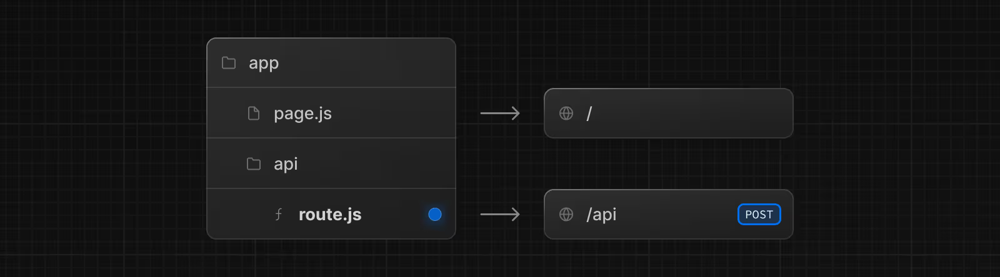

# Route Handlers ve Middleware

## Route Handlers

**Route Handlers**, Web Request ve Response API’lerini kullanarak belirli bir rota için özel istek işleyicileri oluşturmanıza olanak tanır.

### Route.js Özel Dosyası


Bilmeniz iyi olur: **Route Handlers** yalnızca `app` dizini içinde kullanılabilir. Bunlar, `pages` dizinindeki API Routes dosyalarının karşılığıdır. Yani API Routes ve Route Handlers’ı birlikte kullanmanıza gerek yoktur.

### Konvansiyon

Route Handlers, `app` dizini içinde `route.js|ts` dosyası olarak tanımlanır:

```ts
// app/api/route.ts
export async function GET(request: Request) {}
```

Route Handlers, `page.js` ve `layout.js` gibi `app` dizini içinde herhangi bir yerde iç içe tanımlanabilir. Ancak `page.js` ile aynı rota segmentinde bir `route.js` dosyası bulunamaz.

### Desteklenen HTTP Yöntemleri

Şu HTTP yöntemleri desteklenir: **GET, POST, PUT, PATCH, DELETE, HEAD, OPTIONS**.
Desteklenmeyen bir yöntem çağrılırsa, Next.js `405 Method Not Allowed` yanıtı döndürür.

### Genişletilmiş NextRequest ve NextResponse API’leri

Next.js, yerleşik Request ve Response API’lerini desteklemenin yanı sıra, gelişmiş kullanım durumları için kolaylık sağlayan **NextRequest** ve **NextResponse** uzantılarını da sunar.

### Önbellekleme

Route Handlers varsayılan olarak **önbelleğe alınmaz**. Ancak, GET yöntemleri için önbelleğe almayı etkinleştirebilirsiniz.
Desteklenen diğer HTTP yöntemleri önbelleğe alınmaz. Bir GET metodunu önbelleğe almak için Route Handler dosyasında `export const dynamic = 'force-static'` gibi bir rota yapılandırma seçeneğini kullanabilirsiniz:

```ts
// app/items/route.ts
export const dynamic = 'force-static'
 
export async function GET() {
  const res = await fetch('https://data.mongodb-api.com/...', {
    headers: {
      'Content-Type': 'application/json',
      'API-Key': process.env.DATA_API_KEY,
    },
  })
  const data = await res.json()
 
  return Response.json({ data })
}
```

Bilmeniz iyi olur: GET dışındaki diğer yöntemler, aynı dosyada olsa bile, önbelleğe alınmaz.

### Özel Route Handlers

`sitemap.ts`, `opengraph-image.tsx`, `icon.tsx` gibi özel Route Handlers ve diğer metadata dosyaları, **Dynamic API’ler** veya dinamik konfigürasyon seçenekleri kullanılmadığı sürece varsayılan olarak statiktir.

### Rota Çözümleme

Bir rotayı en düşük seviyedeki yönlendirme yapısı olarak düşünebilirsiniz.

* Layout’lara veya istemci tarafı yönlendirmelerine katılmazlar.
* `page.js` ile aynı rotada `route.js` dosyası olamaz.

| Page               | Route            | Sonuç   |
| ------------------ | ---------------- | ------- |
| app/page.js        | app/route.js     | Çakışma |
| app/page.js        | app/api/route.js | Geçerli |
| app/[user]/page.js | app/api/route.js | Geçerli |

Her `route.js` veya `page.js` dosyası, ilgili rota için tüm HTTP yöntemlerini devralır.

```ts
// app/page.ts
export default function Page() {
  return <h1>Hello, Next.js!</h1>
}
 
// Çakışma
// `app/route.ts`
export async function POST(request: Request) {}
```

Daha fazla bilgi için: Route Handlers API Reference.

### Route Context Helper

TypeScript’te, Route Handlers için `context` parametresini global olarak mevcut olan **RouteContext** yardımıyla type’layabilirsiniz:

```ts
// app/users/[id]/route.ts
import type { NextRequest } from 'next/server'
 
export async function GET(_req: NextRequest, ctx: RouteContext<'/users/[id]'>) {
  const { id } = await ctx.params
  return Response.json({ id })
}
```

Bilmeniz iyi olur:

* Tipler `next dev`, `next build` veya `next typegen` sırasında üretilir.

---

## Middleware

**Middleware**, bir istek tamamlanmadan önce kod çalıştırmanıza olanak tanır. Gelen isteğe bağlı olarak:

* Yanıtı yeniden yazabilir,
* Yönlendirme yapabilir,
* İstek veya yanıt başlıklarını değiştirebilir,
* Veya doğrudan yanıt döndürebilirsiniz.

### Kullanım Senaryoları

Middleware’in etkili olduğu durumlar:

* Gelen isteğin belirli kısımlarını okuyarak hızlı yönlendirme yapmak
* A/B testleri veya deneyler için farklı sayfalara yönlendirme
* Tüm sayfalar veya belirli bir alt küme için başlıkları değiştirme

Middleware için uygun olmayan durumlar:

* Yavaş veri çekme işlemleri
* Oturum yönetimi

Not: Middleware içinde `fetch` kullanırken `options.cache`, `options.next.revalidate`, `options.next.tags` etkili değildir.

### Konvansiyon

Bir `middleware.ts` (veya `.js`) dosyası, proje köküne (veya varsa `src` içine) eklenir. Bu dosya `pages` veya `app` ile aynı seviyede olmalıdır.

⚠️ Not: Her projede yalnızca **bir adet** `middleware.ts` dosyası desteklenir.
Ancak middleware mantığınızı modüllere ayırıp ana `middleware.ts` içine import edebilirsiniz.
Bu yaklaşım, route-specific middleware’leri merkezi olarak kontrol etmenizi sağlar, çakışmaları önler ve performansı optimize eder.

### Örnek

```ts
// middleware.ts
import { NextResponse } from 'next/server'
import type { NextRequest } from 'next/server'
 
// İçinde `await` kullanılıyorsa `async` işaretlenebilir
export function middleware(request: NextRequest) {
  return NextResponse.redirect(new URL('/home', request.url))
}
 
// Aşağıda "Matching Paths" bölümüne bakın
export const config = {
  matcher: '/about/:path*',
}
```

Daha fazla bilgi: Middleware API Reference.

---

## API Reference

Daha fazla bilgi için:

* [**route.js**](#) → route.js özel dosyası için API referansı
* [**middleware.js**](#) → middleware.js dosyası için API referansı
* **Backend for Frontend** → Next.js’i bir backend framework olarak kullanmayı öğrenin

