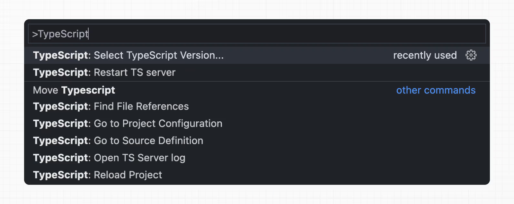

# Kurulum

## Sistem Gereksinimleri

Başlamadan önce sisteminizin aşağıdaki gereksinimleri karşıladığından emin olun:

* **Node.js 18.18 veya daha yeni**
* **macOS**, **Windows** (WSL dahil) veya **Linux**

---

## Otomatik Kurulum

Yeni bir Next.js uygulaması oluşturmanın en hızlı yolu, sizin için her şeyi otomatik olarak ayarlayan **create-next-app** kullanmaktır. Bir proje oluşturmak için şu komutu çalıştırın:

```bash
npx create-next-app@latest
```

Kurulum sırasında aşağıdaki yönlendirmeleri göreceksiniz:

```bash
What is your project named? my-app
Would you like to use TypeScript? No / Yes
Would you like to use ESLint? No / Yes
Would you like to use Tailwind CSS? No / Yes
Would you like your code inside a `src/` directory? No / Yes
Would you like to use App Router? (recommended) No / Yes
Would you like to use Turbopack? (recommended) No / Yes
Would you like to customize the import alias (`@/*` by default)? No / Yes
What import alias would you like configured? @/*
```

Bu adımların ardından **create-next-app**, proje adınızla bir klasör oluşturacak ve gerekli bağımlılıkları yükleyecektir.

---

## Manuel Kurulum

Yeni bir Next.js uygulamasını manuel olarak oluşturmak için gerekli paketleri yükleyin:

```bash
pnpm i next@latest react@latest react-dom@latest
```

💡 **Bilmeniz iyi olur:**

* **App Router**, dahili olarak React’in **canary sürümlerini** kullanır. Bu sürüm, tüm React 19 değişikliklerini ve ayrıca frameworklerde test edilen yeni özellikleri içerir.
* **Pages Router** ise `package.json` içine yüklediğiniz React sürümünü kullanır.

Daha sonra, `package.json` dosyanıza şu script’leri ekleyin:

```json
{
  "scripts": {
    "dev": "next dev --turbopack",
    "build": "next build",
    "start": "next start",
    "lint": "eslint"
  }
}
```

Bu script’ler, uygulama geliştirme sürecindeki farklı aşamalara karşılık gelir:

* **next dev --turbopack**: Turbopack kullanarak geliştirme sunucusunu başlatır.
* **next build**: Uygulamayı production için derler.
* **next start**: Production sunucusunu başlatır.
* **eslint**: ESLint çalıştırır.

👉 **Not:**

* Turbopack geliştirme için stabildir.
* Production derlemelerinde Turbopack beta aşamasındadır. Denemek için:

```bash
next build --turbopack
```

Detaylar ve kısıtlamalar için **Turbopack dokümantasyonuna** bakabilirsiniz.

---

## `app` Klasörünü Oluşturma

Next.js, dosya sistemi tabanlı yönlendirme kullanır. Yani uygulamanızdaki rotalar, dosya yapınıza göre belirlenir.

1. Bir **app** klasörü oluşturun.
2. İçine **layout.tsx** dosyası ekleyin. Bu dosya **root layout**’tur. Zorunludur ve `<html>` ile `<body>` etiketlerini içermelidir.

**app/layout.tsx**

```tsx
export default function RootLayout({
  children,
}: {
  children: React.ReactNode
}) {
  return (
    <html lang="en">
      <body>{children}</body>
    </html>
  )
}
```

3. Bir **ana sayfa** oluşturun: **app/page.tsx**

**app/page.tsx**

```tsx
export default function Page() {
  return <h1>Hello, Next.js!</h1>
}
```

Kullanıcı uygulamanızın kök dizinine (`/`) girdiğinde hem `layout.tsx` hem de `page.tsx` render edilecektir.


# İyi Bilmekte Fayda Var

* Eğer **root layout** dosyası oluşturmayı unutursanız, Next.js geliştirme sunucusunu `next dev` ile çalıştırdığınızda bu dosyayı otomatik olarak oluşturur.
* Uygulamanızın kodlarını yapılandırma dosyalarından ayırmak için, projenizin kök dizininde isteğe bağlı olarak bir **src** klasörü kullanabilirsiniz.

---

## `public` Klasörünü Oluşturma (Opsiyonel)

Projenizin kök dizininde, görseller, fontlar vb. statik dosyaları saklamak için bir **public** klasörü oluşturun.
Bu klasörün içindeki dosyalar, kodunuzdan **base URL (/)** üzerinden referans verilebilir.

Örneğin:
`public/profile.png` dosyasına `/profile.png` yoluyla erişilebilir.

**app/page.tsx**

```tsx
import Image from 'next/image'
 
export default function Page() {
  return <Image src="/profile.png" alt="Profile" width={100} height={100} />
}
```

---

## Geliştirme Sunucusunu Çalıştırma

1. `npm run dev` komutunu çalıştırarak geliştirme sunucusunu başlatın.
2. `http://localhost:3000` adresine giderek uygulamanızı görüntüleyin.
3. `app/page.tsx` dosyasını düzenleyip kaydedin; tarayıcınızda güncellenmiş sonucu göreceksiniz.

---

## TypeScript Kurulumu

* Minimum **TypeScript sürümü:** `v4.5.2`

Next.js, dahili olarak TypeScript desteğiyle gelir. Projenize TypeScript eklemek için:

1. Bir dosyayı `.ts` veya `.tsx` uzantısıyla yeniden adlandırın.
2. `next dev` komutunu çalıştırın.

Next.js gerekli bağımlılıkları otomatik olarak yükleyecek ve önerilen ayarlarla bir **tsconfig.json** dosyası ekleyecektir.

---

## IDE Eklentisi

Next.js, VS Code ve diğer editörlerde gelişmiş tip kontrolü ve otomatik tamamlama için özel bir **TypeScript eklentisi** ve **tip denetleyicisi** içerir.

VS Code’da eklentiyi etkinleştirmek için:

1. **Komut paletini açın** (`Ctrl/⌘ + Shift + P`)
2. “**TypeScript: Select TypeScript Version**” araması yapın
3. “**Use Workspace Version**” seçeneğini seçin




# Daha Fazla Bilgi

Daha fazla bilgi için **TypeScript referans sayfasına** bakabilirsiniz.

---

## ESLint Kurulumu

Next.js, dahili **ESLint** desteğiyle gelir. Yeni bir proje oluştururken `create-next-app`, gerekli paketleri otomatik olarak yükler ve doğru ayarları yapılandırır.

Mevcut bir projeye ESLint’i manuel olarak eklemek için, `package.json` dosyanıza `next lint` script’ini ekleyin:

**package.json**

```json
{
  "scripts": {
    "lint": "next lint"
  }
}
```

Sonra şu komutu çalıştırın:

```bash
npm run lint
```

Kurulum sırasında aşağıdaki gibi bir seçenek göreceksiniz:

```
? How would you like to configure ESLint?

❯ Strict (recommended) 
  Base 
  Cancel
```

* **Strict**: Next.js’in temel ESLint yapılandırmasının yanı sıra daha katı **Core Web Vitals** kurallarını içerir. ESLint’i ilk kez kuran geliştiriciler için önerilir.
* **Base**: Yalnızca Next.js’in temel ESLint yapılandırmasını içerir.
* **Cancel**: Kurulumu atlar. Kendi özel ESLint yapılandırmanızı yapmayı planlıyorsanız bu seçeneği seçin.

**Strict** veya **Base** seçerseniz:

* Next.js, `eslint` ve `eslint-config-next` bağımlılıklarını otomatik olarak yükler.
* Projenizin kök dizinine bir yapılandırma dosyası oluşturur.

👉 Varsayılan olarak `next lint` tarafından oluşturulan ESLint yapılandırması **.eslintrc.json** biçimini kullanır.

* ESLint, hem eski **.eslintrc.json** formatını hem de yeni **eslint.config.mjs** formatını destekler.
* İsterseniz `.eslintrc.json` dosyasını silip yerine **eslint.config.mjs** dosyası ekleyebilirsiniz. Bunun için `@eslint/eslintrc` paketini yüklemeniz ve ESLint API referansındaki önerilen kurulumu uygulamanız gerekir. Bu yöntem, `create-next-app` ile gelen yapılandırmaya daha yakın olacaktır.

Artık her hata yakalamak istediğinizde:

```bash
next lint
```

komutunu çalıştırabilirsiniz.

⚡ Ayrıca, ESLint kurulduktan sonra her derlemede (`next build`) otomatik olarak çalışır.

* **Hatalar** derlemeyi başarısız yapar.
* **Uyarılar** ise derlemeyi engellemez.

Daha fazla bilgi için **ESLint Plugin** sayfasına bakabilirsiniz.

---

## Absolute Imports ve Module Path Aliases Kurulumu

Next.js, **tsconfig.json** ve **jsconfig.json** dosyalarındaki `"paths"` ve `"baseUrl"` seçeneklerini dahili olarak destekler.

Bu ayarlar, proje dizinlerini **absolute path** olarak kullanmanıza ve daha temiz import ifadeleri yazmanıza olanak tanır.

Örnek:

```ts
// Önce
import { Button } from '../../../components/button'

// Sonra
import { Button } from '@/components/button'
```

### `baseUrl` Ayarı

`tsconfig.json` veya `jsconfig.json` dosyanıza şu ayarı ekleyin:

```json
{
  "compilerOptions": {
    "baseUrl": "src/"
  }
}
```

### `paths` Ayarı

`baseUrl` dışında, `"paths"` seçeneğini kullanarak modül yollarına alias verebilirsiniz.

Örnek:

```json
{
  "compilerOptions": {
    "baseUrl": "src/",
    "paths": {
      "@/styles/*": ["styles/*"],
      "@/components/*": ["components/*"]
    }
  }
}
```

Buradaki her `"paths"` ayarı, `baseUrl` konumuna göre görecelidir.
