# Proje Yapısı ve Organizasyonu

Bu sayfa, Next.js’teki tüm klasör ve dosya kurallarına genel bir bakış sunar ve projenizi organize etmeniz için öneriler içerir.

---

## Klasör ve Dosya Kuralları

### Üst Düzey Klasörler

Üst düzey klasörler, uygulamanızın kodlarını ve statik varlıklarını düzenlemek için kullanılır.

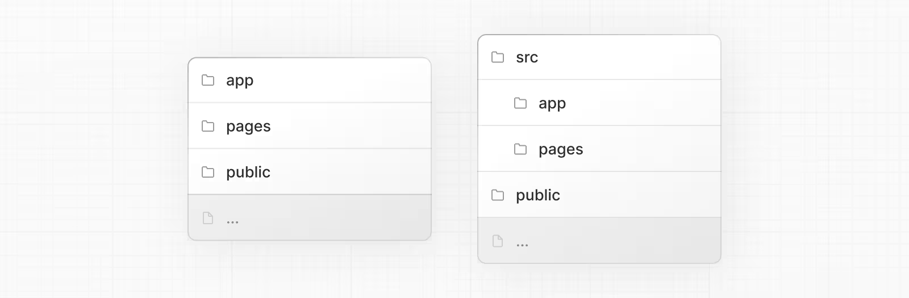
# Proje Yapısı ve Organizasyonu

## Üst Düzey Klasörler

Üst düzey klasörler, uygulamanızın kodlarını ve statik varlıklarını düzenlemek için kullanılır:

| Klasör     | Açıklama                          |
| ---------- | --------------------------------- |
| **app**    | App Router                        |
| **pages**  | Pages Router                      |
| **public** | Sunulacak statik varlıklar        |
| **src**    | Opsiyonel uygulama kaynak klasörü |

---

## Üst Düzey Dosyalar

Üst düzey dosyalar, uygulamanızı yapılandırmak, bağımlılıkları yönetmek, middleware çalıştırmak, izleme araçlarını entegre etmek ve ortam değişkenlerini tanımlamak için kullanılır:

| Next.js Dosyaları      | Açıklama                                           |
| ---------------------- | -------------------------------------------------- |
| **next.config.js**     | Next.js yapılandırma dosyası                       |
| **package.json**       | Proje bağımlılıkları ve script’ler                 |
| **instrumentation.ts** | OpenTelemetry ve enstrümantasyon dosyası           |
| **middleware.ts**      | Next.js istek middleware’i                         |
| **.env**               | Ortam değişkenleri                                 |
| **.env.local**         | Yerel ortam değişkenleri                           |
| **.env.production**    | Production ortam değişkenleri                      |
| **.env.development**   | Development ortam değişkenleri                     |
| **.eslintrc.json**     | ESLint yapılandırma dosyası                        |
| **.gitignore**         | Git tarafından yok sayılacak dosyalar ve klasörler |
| **next-env.d.ts**      | Next.js için TypeScript bildirim dosyası           |
| **tsconfig.json**      | TypeScript yapılandırma dosyası                    |
| **jsconfig.json**      | JavaScript yapılandırma dosyası                    |

---

## Yönlendirme Dosyaları

| Dosya                           | Açıklama                     |
| ------------------------------- | ---------------------------- |
| **layout.(js, jsx, tsx)**       | Layout                       |
| **page.(js, jsx, tsx)**         | Sayfa                        |
| **loading.(js, jsx, tsx)**      | Yükleme arayüzü              |
| **not-found.(js, jsx, tsx)**    | Bulunamadı arayüzü           |
| **error.(js, jsx, tsx)**        | Hata arayüzü                 |
| **global-error.(js, jsx, tsx)** | Global hata arayüzü          |
| **route.(js, ts)**              | API endpoint                 |
| **template.(js, jsx, tsx)**     | Yeniden render edilen layout |
| **default.(js, jsx, tsx)**      | Paralel rota yedek sayfası   |

---

## İç İçe Rotalar

* **folder** → Rota segmenti
* **folder/folder** → İç içe rota segmenti

---

## Dinamik Rotalar

* **[folder]** → Dinamik rota segmenti
* **[...folder]** → Tümünü yakalayan rota segmenti
* **[[...folder]]** → Opsiyonel tümünü yakalayan rota segmenti

---

## Rota Grupları ve Özel Klasörler

* **(folder)** → Rotaları gruplar, yönlendirmeyi etkilemez
* **_folder** → Klasörü ve alt segmentlerini yönlendirme dışında tutar

---

## Paralel ve Yakalanan Rotalar

* **@folder** → İsimlendirilmiş slot
* **(.)folder** → Aynı seviyede yakala
* **(..)folder** → Bir üst seviyede yakala
* **(..)(..)folder** → İki üst seviyede yakala
* **(...)folder** → Root’tan itibaren yakala

---

## Metadata Dosya Kuralları

### Uygulama İkonları

| Dosya                               | Açıklama                           |
| ----------------------------------- | ---------------------------------- |
| **favicon.ico**                     | Favicon dosyası                    |
| **icon.(ico, jpg, jpeg, png, svg)** | Uygulama ikonu                     |
| **icon.(js, ts, tsx)**              | Dinamik oluşturulan uygulama ikonu |
| **apple-icon.(jpg, jpeg, png)**     | Apple uygulama ikonu               |
| **apple-icon.(js, ts, tsx)**        | Dinamik oluşturulan Apple ikonu    |

### Open Graph ve Twitter Görselleri

| Dosya                                     | Açıklama                   |
| ----------------------------------------- | -------------------------- |
| **opengraph-image.(jpg, jpeg, png, gif)** | Open Graph görseli         |
| **opengraph-image.(js, ts, tsx)**         | Dinamik Open Graph görseli |
| **twitter-image.(jpg, jpeg, png, gif)**   | Twitter görseli            |
| **twitter-image.(js, ts, tsx)**           | Dinamik Twitter görseli    |

### SEO

| Dosya                | Açıklama               |
| -------------------- | ---------------------- |
| **sitemap.xml**      | Sitemap dosyası        |
| **sitemap.(js, ts)** | Dinamik Sitemap        |
| **robots.txt**       | Robots dosyası         |
| **robots.(js, ts)**  | Dinamik Robots dosyası |

---

## Projenizi Organize Etme

Next.js, dosyalarınızı nasıl organize edeceğiniz konusunda katı bir yaklaşım benimsemez. Ancak projenizi düzenlemenize yardımcı olacak bazı özellikler sağlar.

---

## Bileşen Hiyerarşisi

Özel dosyalarda tanımlanan bileşenler belirli bir hiyerarşi içinde render edilir:

1. **layout.js**
2. **template.js**
3. **error.js** (React error boundary)
4. **loading.js** (React suspense boundary)
5. **not-found.js** (React error boundary)
6. **page.js** veya iç içe **layout.js**

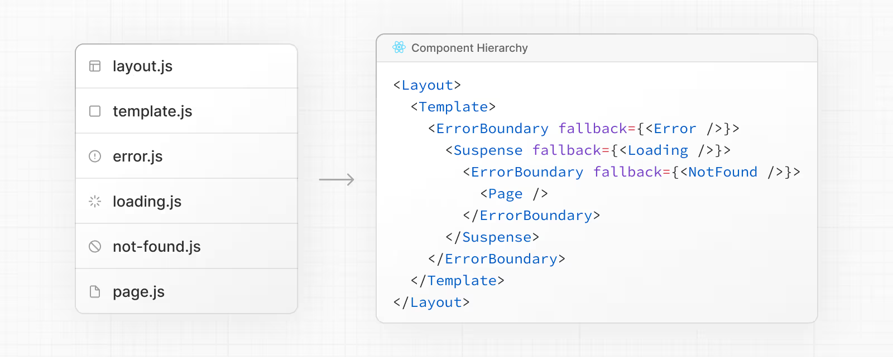

Bileşenler, iç içe rotalarda **özyinelemeli (recursive)** olarak render edilir. Yani bir rota segmentinin bileşenleri, üst segmentinin bileşenlerinin içine gömülür.

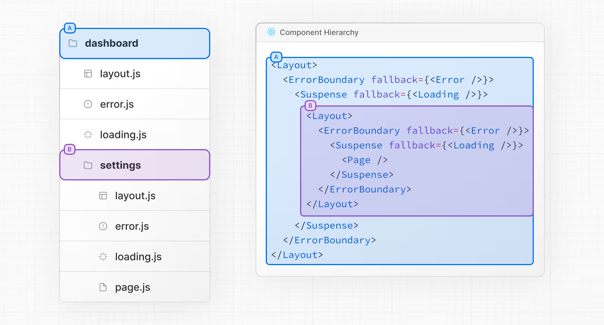

# Colocation

**app** dizininde, iç içe klasörler rota yapısını tanımlar.
Her klasör, URL yolundaki karşılık gelen bir rota segmentine eşlenir.

Ancak, rota yapısı klasörler üzerinden tanımlansa da, bir rota **page.js** veya **route.js** dosyası eklenene kadar **herkese açık olarak erişilebilir hale gelmez**.

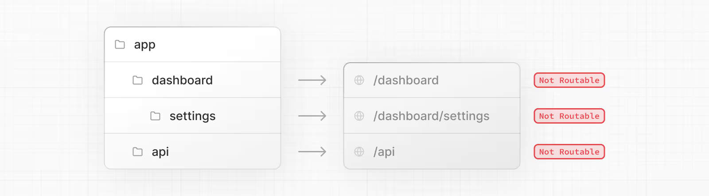

Ve, bir rota herkese açık hale gelse bile, istemciye yalnızca **page.js** veya **route.js** dosyası tarafından döndürülen içerik gönderilir.

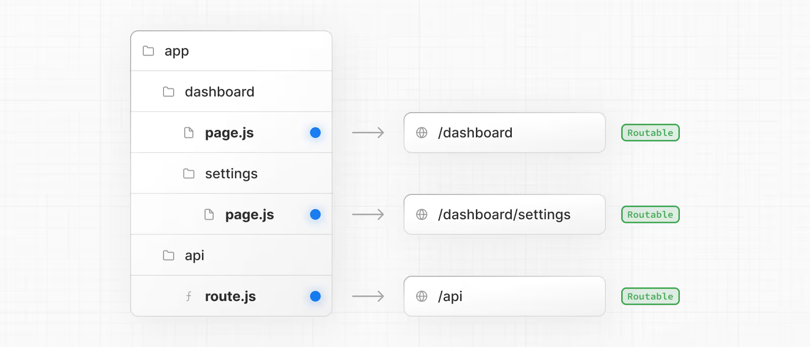
Bu, proje dosyalarının **app** dizinindeki rota segmentlerinin içine güvenle yerleştirilebileceği ve yanlışlıkla erişilebilir bir rota haline gelmeyeceği anlamına gelir.

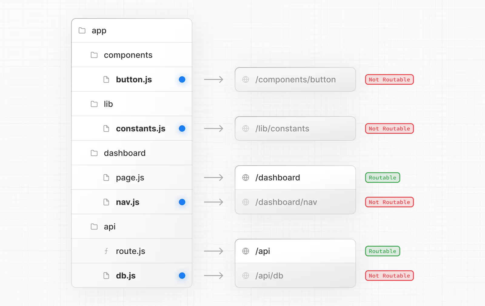

# İyi Bilmekte Fayda Var

Proje dosyalarınızı **app** dizinine yerleştirebilirsiniz, ancak bu zorunlu değildir. İsterseniz bu dosyaları **app** dizini dışında da tutabilirsiniz.

---

## Özel (Private) Klasörler

Bir klasörün önüne alt çizgi (`_`) ekleyerek özel klasörler oluşturabilirsiniz:

```
_folderName
```

Bu, klasörün yalnızca dahili bir implementasyon detayı olduğunu ve **routing sistemi tarafından dikkate alınmaması gerektiğini** belirtir. Böylece ilgili klasör ve tüm alt klasörleri yönlendirme dışında bırakılır.

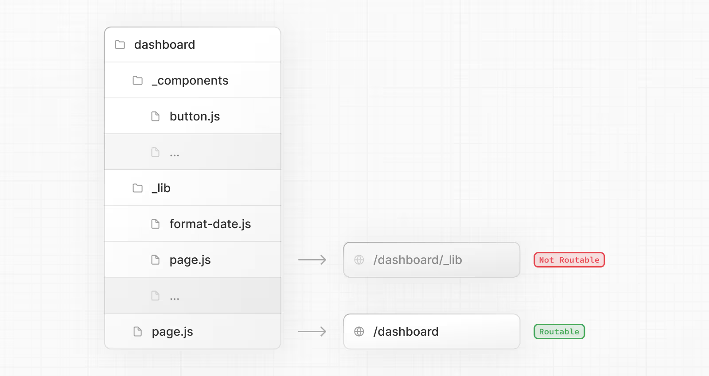

Varsayılan olarak dosyalar **app** dizininde güvenle konumlandırılabildiğinden, **özel klasörler (private folders)** colocation için gerekli değildir. Ancak şu durumlarda faydalı olabilirler:

* **UI mantığını** yönlendirme mantığından ayırmak.
* Dahili dosyaları, proje genelinde ve Next.js ekosisteminde **tutarlı bir şekilde organize etmek**.
* Kod editörlerinde dosyaları **sıralamak ve gruplamak**.
* Gelecekteki Next.js dosya kurallarıyla **potansiyel isim çakışmalarını önlemek**.

---

## İyi Bilmekte Fayda Var

* Bir framework kuralı olmasa da, **özel klasörler dışında kalan dosyaları da** aynı alt çizgi (`_`) kuralıyla “private” olarak işaretleyebilirsiniz.

* Alt çizgi ile başlayan URL segmentleri oluşturmak için, klasör adının başına `%5F` (alt çizginin URL kodlanmış hali) ekleyebilirsiniz:

  ```
  %5FfolderName
  ```

* Eğer özel klasörleri kullanmazsanız, **Next.js özel dosya kurallarını** bilmeniz, beklenmedik isim çakışmalarını önlemek açısından faydalı olur.

---

## Rota Grupları

Bir klasörü parantez içine alarak rota grupları oluşturabilirsiniz:

```
(folderName)
```

Bu, klasörün **yalnızca organizasyon amacıyla** kullanıldığını ve **rota URL yoluna dahil edilmemesi gerektiğini** belirtir.

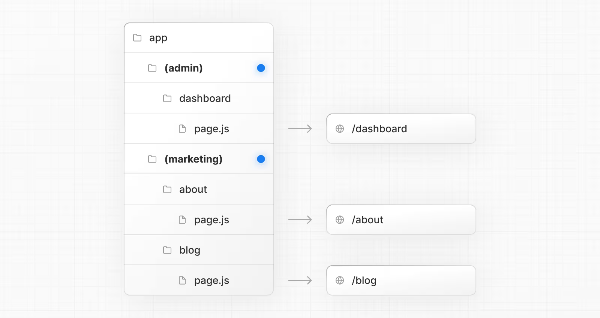

# Rota Grupları

Rota grupları şu durumlarda faydalıdır:

* Rotaları **site bölümlerine**, amaca veya takıma göre organize etmek
  *(ör. marketing sayfaları, admin sayfaları vb.)*
* Aynı rota segmenti seviyesinde iç içe layout’ları etkinleştirmek:

  * Aynı segmentte birden fazla iç içe layout oluşturmak (birden fazla root layout dahil)
  * Ortak bir segment içindeki rotaların belirli bir alt kümesine layout eklemek

---

# `src` Klasörü

Next.js, uygulama kodlarını (örn. **app** dahil) opsiyonel bir **src** klasörü içinde saklamayı destekler.

Bu yaklaşım, uygulama kodlarını genellikle projenin kök dizininde bulunan **yapılandırma dosyalarından** ayırmaya yardımcı olur.

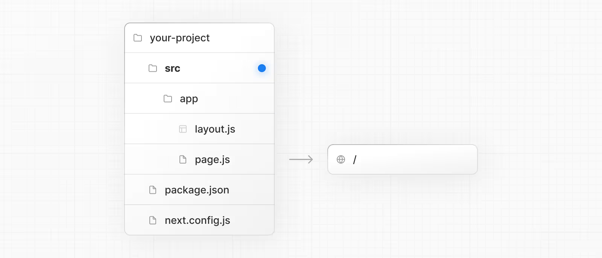

# Örnekler

Aşağıdaki bölüm, yaygın stratejilere çok üst düzey bir bakış sunar.
En basit çıkarım şudur: **Ekip olarak size uyan bir strateji seçin ve proje genelinde tutarlı olun.**

---

## İyi Bilmekte Fayda Var

Aşağıdaki örneklerde, **components** ve **lib** klasörlerini genel amaçlı yer tutucular olarak kullanıyoruz.
Bu klasör adlarının framework açısından özel bir anlamı yoktur.
Projelerinizde bunun yerine **ui**, **utils**, **hooks**, **styles** vb. klasörler kullanabilirsiniz.

---

## Proje Dosyalarını `app` Dışında Saklamak

Bu stratejide, tüm uygulama kodları projenizin kök dizinindeki **paylaşılan klasörlerde** tutulur.
`app` dizini ise yalnızca **routing amacıyla** kullanılır.

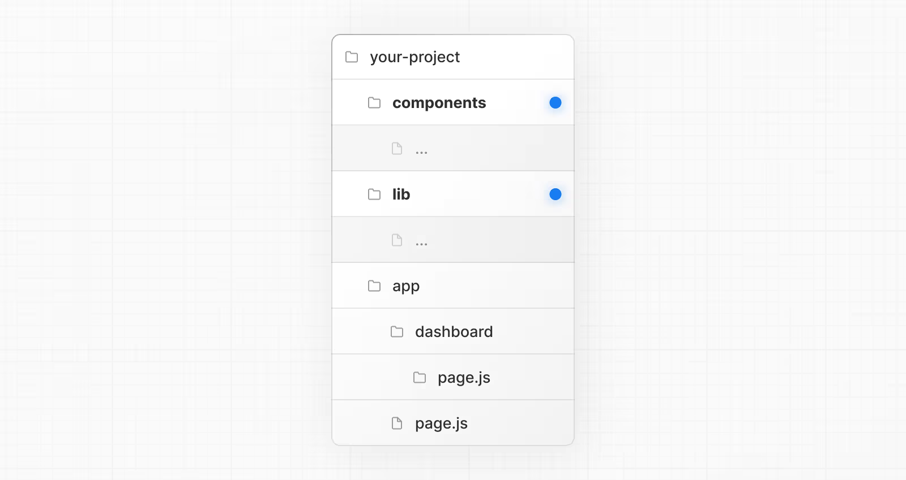
## Proje Dosyalarını `app` İçindeki Üst Düzey Klasörlerde Saklamak

Bu stratejide, tüm uygulama kodları **app** dizininin kökünde bulunan **paylaşılan klasörlerde** tutulur.

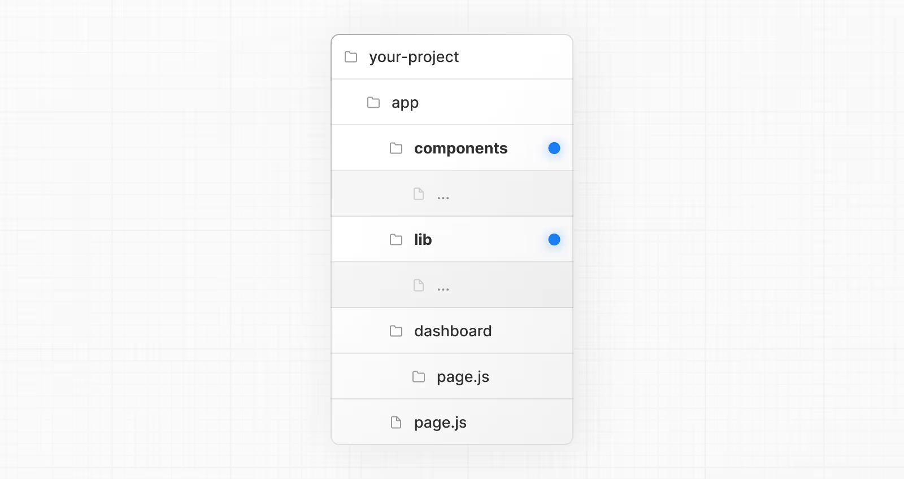

## Proje Dosyalarını Özellik veya Rotalara Göre Ayırmak

Bu stratejide, **global olarak paylaşılan uygulama kodları** `app` dizininin kökünde tutulur.
Daha spesifik uygulama kodları ise, onları kullanan **rota segmentlerine** yerleştirilir.

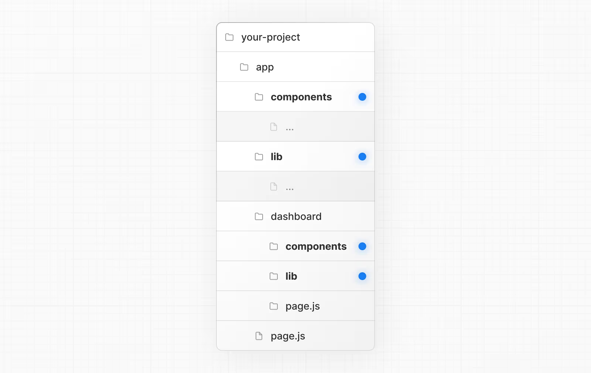

## URL Yolunu Etkilemeden Rotaları Organize Etmek

Rotaları URL’yi etkilemeden organize etmek için, ilgili rotaları bir arada tutacak **gruplar** oluşturabilirsiniz.

Parantez içindeki klasörler URL’den çıkarılır:
Örneğin:

```
(marketing)
(shop)
```
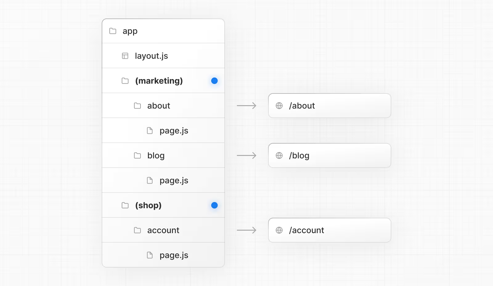

Her ne kadar `(marketing)` ve `(shop)` içindeki rotalar aynı URL hiyerarşisini paylaşsa da, bu klasörlerin içine bir **layout.js** dosyası ekleyerek her grup için farklı bir layout oluşturabilirsiniz.


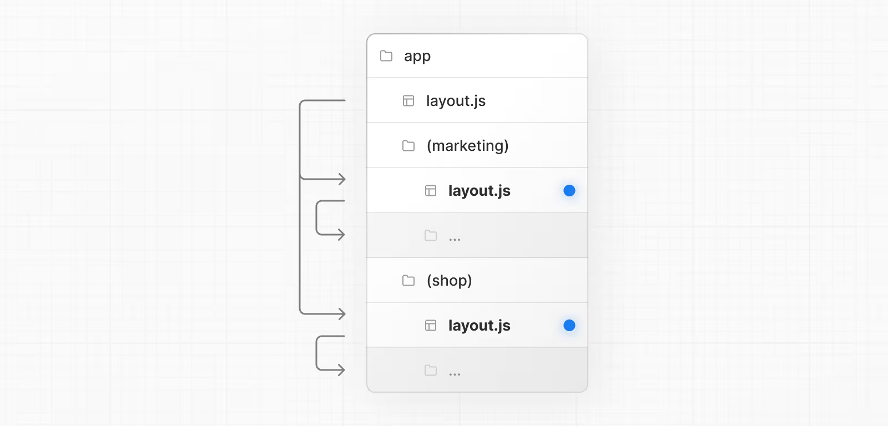

## Belirli Segmentleri Bir Layout İçine Dahil Etmek

Belirli rotaları bir layout içine almak için yeni bir **rota grubu** oluşturun (örn. `(shop)`) ve aynı layout’u paylaşacak rotaları bu grubun içine taşıyın (örn. `account` ve `cart`).

Grubun dışında kalan rotalar (örn. `checkout`) bu layout’u paylaşmaz.


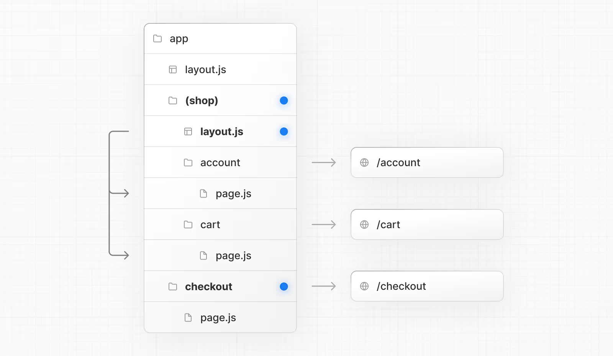

## Belirli Bir Rota İçin Loading Skeleton Kullanmak

Belirli bir rotaya **loading skeleton** uygulamak için, yeni bir **rota grubu** oluşturun (örn. `/(overview)`) ve ardından `loading.tsx` dosyanızı bu rota grubunun içine taşıyın.


Artık, `loading.tsx` dosyası tüm dashboard sayfalarına değil, yalnızca **dashboard → overview** sayfasına uygulanacaktır ve bu durum URL yol yapısını etkilemez.

---

## Birden Fazla Root Layout Oluşturmak

Birden fazla **root layout** oluşturmak için:

1. Üst düzeydeki `layout.js` dosyasını kaldırın.
2. Her rota grubunun içine bir `layout.js` dosyası ekleyin.

Bu yöntem, tamamen farklı bir **UI** veya deneyime sahip bölümlere ayrılmış uygulamalar için faydalıdır.

⚠️ Her root layout dosyasında `<html>` ve `<body>` etiketlerinin bulunması gerekir.

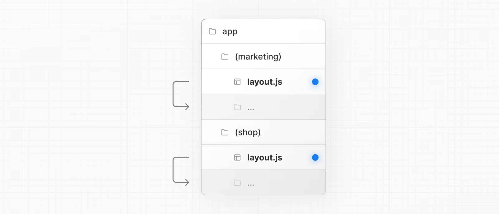

Yukarıdaki örnekte, hem **(marketing)** hem de **(shop)** kendi root layout’una sahiptir.

