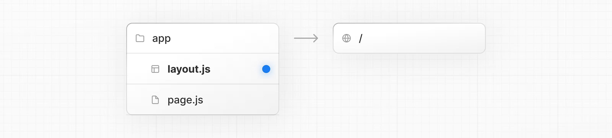
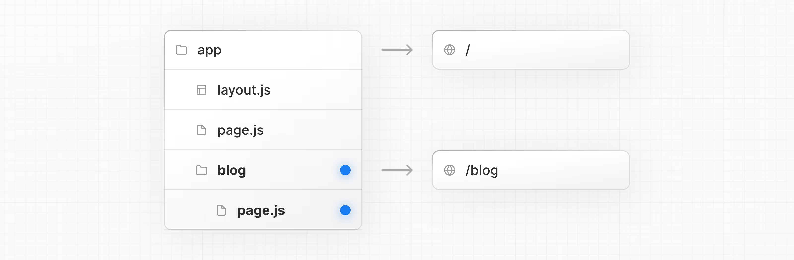
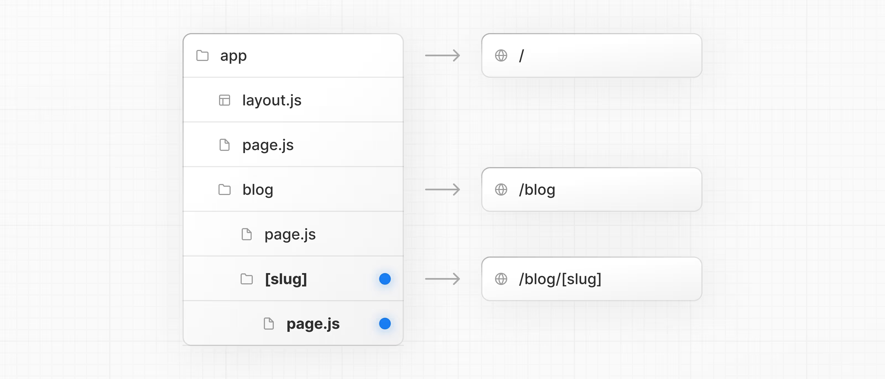
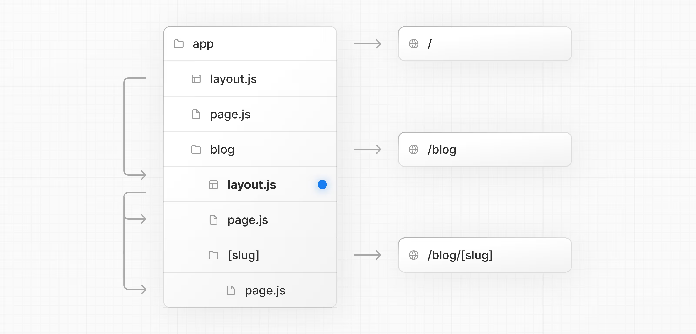

# Layouts ve Sayfalar

Next.js, dosya sistemi tabanlı yönlendirme kullanır; yani yönlendirmeleri tanımlamak için klasörler ve dosyaları kullanabilirsiniz. Bu sayfa size nasıl **layout** (yerleşim) ve **page** (sayfa) oluşturacağınızı ve bunlar arasında bağlantı kuracağınızı gösterecek.

## Sayfa Oluşturma

Bir **sayfa**, belirli bir route üzerinde render edilen kullanıcı arayüzüdür. Bir sayfa oluşturmak için `app` dizini içine bir `page` dosyası ekleyin ve varsayılan olarak bir React bileşeni dışa aktarın. Örneğin, bir ana sayfa (`/`) oluşturmak için:


app/page.tsx
TypeScript

````
export default function Page() {
  return <h1>Hello Next.js!</h1>
}
````



### app/layout.tsx


````ts
export default function DashboardLayout({
  children,
}: {
  children: React.ReactNode
}) {
  return (
    <html lang="en">
      <body>
        {/* Layout arayüzü */}
        {/* Bir sayfayı veya iç içe geçmiş bir layout'u render etmek istediğiniz yere children yerleştirin */}
        <main>{children}</main>
      </body>
    </html>
  )
}

````

Yukarıdaki layout, `app` dizininin kökünde tanımlandığı için **root layout** (kök yerleşim) olarak adlandırılır. Root layout zorunludur ve mutlaka `html` ve `body` etiketlerini içermelidir.

## İç İçe Route Oluşturma

**Nested route** (iç içe yönlendirme), birden fazla URL segmentinden oluşan bir route’tur. Örneğin, `/blog/[slug]` route’u üç segmentten oluşur:

* `/` (Kök Segment)
* `blog` (Segment)
* `[slug]` (Yaprak Segment)

Next.js’te:

* **Klasörler**, URL segmentleriyle eşleşen route segmentlerini tanımlar.
* **Dosyalar** (`page`, `layout` gibi), bir segment için gösterilecek kullanıcı arayüzünü oluşturur.

İç içe route oluşturmak için klasörleri birbirinin içine yerleştirebilirsiniz.
Örneğin, `/blog` route’unu eklemek için `app` dizini içinde `blog` adında bir klasör oluşturun. Ardından, `/blog` adresini herkese açık hale getirmek için bu klasörün içine bir `page.tsx` dosyası ekleyin:




```tsx
app/blog/page.tsx

// Örnek (dummy) importlar
import { getPosts } from '@/lib/posts'
import { Post } from '@/ui/post'
 
export default async function Page() {
  const posts = await getPosts()
 
  return (
    <ul>
      {posts.map((post) => (
        <Post key={post.id} post={post} />
      ))}
    </ul>
  )
}
```

Klasörleri iç içe koyarak **nested route** (iç içe yönlendirme) oluşturmaya devam edebilirsiniz.
Örneğin, belirli bir blog gönderisi için route oluşturmak üzere `blog` klasörü içinde yeni bir `[slug]` klasörü açın ve içine bir `page` dosyası ekleyin:




```tsx
app/blog/[slug]/page.tsx
TypeScript

function generateStaticParams() {}
 
export default function Page() {
  return <h1>Hello, Blog Post Page!</h1>
}
```

Bir klasör adını köşeli parantez içine almak (ör. `[slug]`), verilerden birden fazla sayfa oluşturmak için kullanılan **dinamik bir route segmenti** meydana getirir. Örneğin: blog gönderileri, ürün sayfaları vb.

## Layout’ları İç İçe Kullanma

Varsayılan olarak, klasör hiyerarşisindeki layout’lar da iç içe geçer; bu da onların `children` prop’u aracılığıyla alt layout’ları sarmaladığı anlamına gelir.
Belirli route segmentlerine (klasörlere) `layout` dosyası ekleyerek layout’ları iç içe yerleştirebilirsiniz.

Örneğin, `/blog` route’u için bir layout oluşturmak üzere `blog` klasörünün içine yeni bir `layout` dosyası ekleyin.

**Dosya hiyerarşisi:**
Root layout → Blog layout





```tsx
app/blog/layout.tsx
TypeScript

export default function BlogLayout({
  children,
}: {
  children: React.ReactNode
}) {
  return <section>{children}</section>
}
```

Yukarıdaki iki layout’u birleştirdiğinizde, root layout (`app/layout.js`) → blog layout (`app/blog/layout.js`) → blog sayfası (`app/blog/page.js`) ve blog gönderi sayfasını (`app/blog/[slug]/page.js`) sarmalar.

## Dinamik Segment Oluşturma

**Dinamik segmentler**, verilerden üretilen route’lar oluşturmanıza olanak tanır.
Örneğin, her bir blog gönderisi için tek tek route oluşturmak yerine, gönderi verilerine göre route’ları üretecek dinamik bir segment oluşturabilirsiniz.

Dinamik segment oluşturmak için segment (klasör) adını köşeli parantez içine alın: `[segmentName]`.
Örneğin, `app/blog/[slug]/page.tsx` route’unda `[slug]` dinamik segmenttir.

```tsx
app/blog/[slug]/page.tsx
TypeScript

export default async function BlogPostPage({
  params,
}: {
  params: Promise<{ slug: string }>
}) {
  const { slug } = await params
  const post = await getPost(slug)
 
  return (
    <div>
      <h1>{post.title}</h1>
      <p>{post.content}</p>
    </div>
  )
}
```

👉 Dinamik Segmentler ve `params` prop’u hakkında daha fazla bilgi edinin.

Dinamik Segmentler içindeki **nested layout**’lar da `params` prop’una erişebilir.

---

## Search Params ile Render Etme

Bir **Server Component** sayfasında, arama parametrelerine `searchParams` prop’u ile erişebilirsiniz:

```tsx
app/page.tsx
TypeScript

export default async function Page({
  searchParams,
}: {
  searchParams: Promise<{ [key: string]: string | string[] | undefined }>
}) {
  const filters = (await searchParams).filters
}
```

`searchParams` kullanmak, sayfanızı **dinamik render** moduna geçirir çünkü arama parametrelerini okumak için gelen isteğe ihtiyaç vardır.

**Client Components** ise arama parametrelerini `useSearchParams` hook’u ile okuyabilir.

👉 `useSearchParams` hakkında statik ve dinamik render edilen route’larda daha fazla bilgi edinin.

### Ne zaman hangisini kullanmalı?

* **`searchParams` prop’unu kullanın**, eğer sayfada veri yüklemek için arama parametrelerine ihtiyacınız varsa (örn. sayfalama, veritabanından filtreleme).
* **`useSearchParams` kullanın**, eğer arama parametreleri yalnızca istemci tarafında kullanılacaksa (örn. props ile gelen bir listeyi filtrelemek).
* Küçük bir optimizasyon olarak, yeniden render tetiklemeden arama parametrelerini okumak için `new URLSearchParams(window.location.search)` ifadesini callback’lerde veya event handler’larda kullanabilirsiniz.

---

## Sayfalar Arasında Bağlantı Kurma

Route’lar arasında gezinmek için `<Link>` bileşenini kullanabilirsiniz.
`<Link>`, HTML `<a>` etiketini genişleten ve **prefetching** ile istemci tarafı gezinmeyi sağlayan yerleşik bir Next.js bileşenidir.

Örneğin, blog gönderileri listesini oluşturmak için `next/link`’ten `<Link>` import edin ve bileşene bir `href` prop’u verin:

```tsx
app/ui/post.tsx
TypeScript

import Link from 'next/link'
 
export default async function Post({ post }) {
  const posts = await getPosts()
 
  return (
    <ul>
      {posts.map((post) => (
        <li key={post.slug}>
          <Link href={`/blog/${post.slug}`}>{post.title}</Link>
        </li>
      ))}
    </ul>
  )
}
```

💡 İyi Bilmekte Fayda Var: `<Link>`, Next.js’te route’lar arasında gezinmenin **birincil yoludur**. Daha gelişmiş gezinme senaryoları için `useRouter` hook’unu da kullanabilirsiniz.

---

## Route Props Yardımcıları

Next.js, route yapınızdan `params` ve **named slot**’ları çıkaran yardımcı tipler sunar:

* **`PageProps`**: `params` ve `searchParams` dahil olmak üzere sayfa bileşenleri için props.
* **`LayoutProps`**: `children` ve named slot’lar (örn. `@analytics` klasörleri) dahil layout bileşenleri için props.

Bu yardımcı tipler, `next dev`, `next build` veya `next typegen` çalıştırıldığında otomatik olarak oluşturulur ve **global** olarak kullanılabilir.

```tsx
app/blog/[slug]/page.tsx

export default async function Page(props: PageProps<'/blog/[slug]'>) {
  const { slug } = await props.params
  return <h1>Blog post: {slug}</h1>
}
```

```tsx
app/dashboard/layout.tsx

export default function Layout(props: LayoutProps<'/dashboard'>) {
  return (
    <section>
      {props.children}
      {/* Eğer app/dashboard/@analytics varsa, typed slot olarak görünür: */}
      {/* {props.analytics} */}
    </section>
  )
}
```

💡 İyi Bilmekte Fayda Var:

* Statik route’lar için `params` → `{}` döner.
* `PageProps`, `LayoutProps` global yardımcı tiplerdir → import etmeye gerek yoktur.
* Tipler, `next dev`, `next build` veya `next typegen` sırasında üretilir.

---

## API Referansı

Bu sayfada bahsedilen özellikler hakkında daha fazlasını öğrenmek için:

* **[Linking and Navigating]**: Dahili gezinme optimizasyonlarının (prefetching, prerendering, client-side navigation) nasıl çalıştığını öğrenin.
* **[layout.js]**: `layout.js` dosyası için API referansı.
* **[page.js]**: `page.js` dosyası için API referansı.
* **[Link Component]**: Yerleşik `next/link` bileşeniyle hızlı istemci tarafı gezinmeyi etkinleştirin.
* **[Dynamic Segments]**: Dinamik route segmentlerini kullanarak programatik olarak route segmentleri oluşturun.
