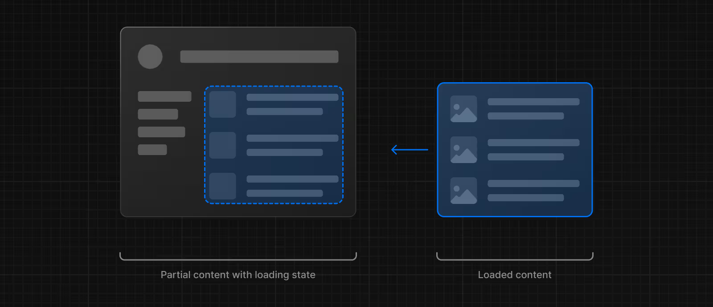
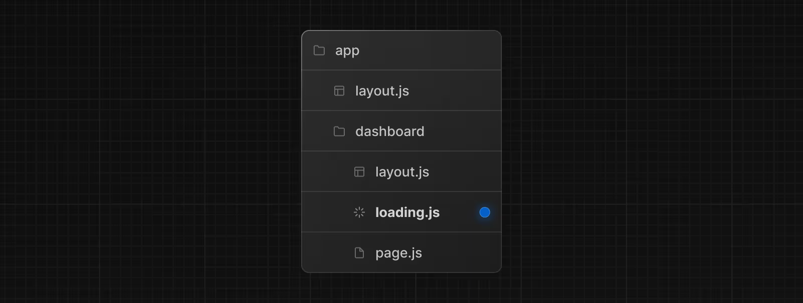
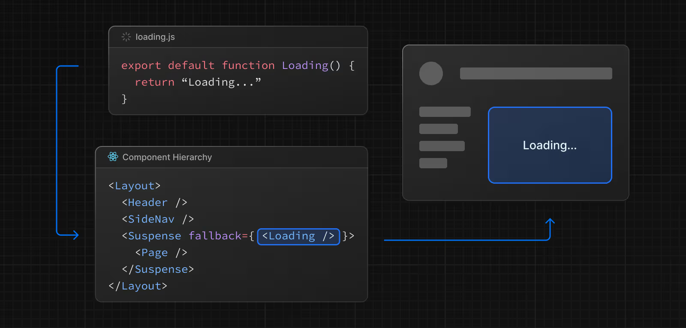

````markdown
loading.js  
Özel dosya **loading.js**, React Suspense ile anlamlı bir **Yükleme UI** oluşturmanıza yardımcı olur. Bu yöntemle, bir rota segmentinin içeriği akışla gelirken sunucudan anında bir yükleme durumu gösterebilirsiniz. İçerik tamamlandığında otomatik olarak yeni içerikle değiştirilir.  



---

## Loading UI

app/feed/loading.tsx  
TypeScript

```typescript
export default function Loading() {
  // Veya özel bir yükleme iskeleti bileşeni
  return <p>Loading...</p>
}
````

`loading.js` dosyası içinde hafif bir yükleme arayüzü ekleyebilirsiniz. Suspense sınırlarını manuel olarak açıp kapatmak için **React Developer Tools** kullanışlı olabilir.

Varsayılan olarak bu dosya bir **Server Component**’tir, ancak `"use client"` yönergesi ile **Client Component** olarak da kullanılabilir.

---

## Referans

### Parametreler

Loading UI bileşenleri parametre kabul etmez.

### Davranış

#### Navigasyon

* Fallback UI önceden getirildiği için, ön getirme tamamlanmamışsa bile, navigasyon anında gerçekleşir.
* Navigasyon kesintiye uğrayabilir; yani, başka bir rotaya geçmek için mevcut içeriğin tamamen yüklenmesini beklemeniz gerekmez.
* Paylaşılan layout bileşenleri, yeni rota segmentleri yüklenirken etkileşimli kalır.

#### Anında Yükleme Durumları

Anında yükleme durumu, navigasyonla birlikte hemen gösterilen **fallback UI**’dir. Örneğin: skeleton, spinner veya gelecekteki ekranların küçük ama anlamlı parçaları (kapak fotoğrafı, başlık vb.) önceden oluşturulabilir. Bu, kullanıcıların uygulamanın yanıt verdiğini anlamasına yardımcı olur ve daha iyi bir deneyim sağlar.

Bir klasörün içine **loading.js** dosyası ekleyerek yükleme durumu oluşturabilirsiniz.


---

### loading.js özel dosyası

app/dashboard/loading.tsx
TypeScript

```typescript
export default function Loading() {
  // Loading içine Skeleton gibi herhangi bir UI ekleyebilirsiniz.
  return <LoadingSkeleton />
}
```

Aynı klasörde, `loading.js`, `layout.js`’in içine gömülür. `page.js` dosyasını ve altındaki tüm bileşenleri otomatik olarak bir `<Suspense>` sınırına sarar.


---

## loading.js genel bakış

### SEO

* Next.js, `generateMetadata` içindeki veri alımının tamamlanmasını bekler ve ardından UI’yi istemciye akıtır.
* Bu, gönderilen yanıtın ilk bölümünde `<head>` etiketlerini garanti eder.
* Akış server-rendered olduğundan, **SEO’yu etkilemez**.
* Sayfanızın Google’a nasıl göründüğünü görmek için Google’ın **Rich Results Test** aracını kullanabilirsiniz.

### Durum Kodları

* Akış sırasında, başarılı bir isteği belirtmek için **200** durum kodu döndürülür.
* Sunucu, yönlendirme (`redirect`) veya bulunamadı (`notFound`) gibi hataları yine akış içeriğinde istemciye iletebilir. Ancak yanıt başlıkları zaten gönderildiği için, durum kodu güncellenemez. Bu, SEO’yu etkilemez.

### Tarayıcı Limitleri

* Bazı tarayıcılar akış yanıtını tamponlar. Yanıt **1024 baytı aşmadıkça** akışı göremeyebilirsiniz.
* Bu genelde “hello world” uygulamalarını etkiler, gerçek uygulamalarda sorun olmaz.

### Platform Desteği

| Dağıtım Seçeneği | Destekleniyor mu? |
| ---------------- | ----------------- |
| Node.js server   | Evet              |
| Docker container | Evet              |
| Static export    | Hayır             |
| Adapters         | Platforma özel    |

Kendi kendine barındırmada Next.js için akış yapılandırmasını öğrenin.

---

## Örnekler

### Suspense ile Akış

`loading.js`’e ek olarak, kendi UI bileşenleriniz için manuel olarak **Suspense Boundaries** oluşturabilirsiniz. **App Router**, Suspense ile akışı destekler.

`<Suspense>`, asenkron bir işlem (örn. veri çekme) yapan bileşeni sararak çalışır. İşlem sırasında fallback UI (örn. skeleton, spinner) gösterilir ve işlem tamamlandığında gerçek bileşen devreye girer.

app/dashboard/page.tsx
TypeScript

```typescript
import { Suspense } from 'react'
import { PostFeed, Weather } from './Components'
 
export default function Posts() {
  return (
    <section>
      <Suspense fallback={<p>Loading feed...</p>}>
        <PostFeed />
      </Suspense>
      <Suspense fallback={<p>Loading weather...</p>}>
        <Weather />
      </Suspense>
    </section>
  )
}
```

**Suspense ile elde edilen avantajlar:**

* **Streaming Server Rendering** → HTML’in sunucudan istemciye aşamalı olarak işlenmesi.
* **Selective Hydration** → React, kullanıcı etkileşimine göre hangi bileşenlerin önce etkileşimli yapılacağını önceliklendirir.

Daha fazla örnek ve kullanım için [React Documentation](https://react.dev/) sayfasına bakabilirsiniz.

---

## Sürüm Geçmişi

| Sürüm   | Değişiklikler               |
| ------- | --------------------------- |
| v13.0.0 | `loading` özelliği eklendi. |


