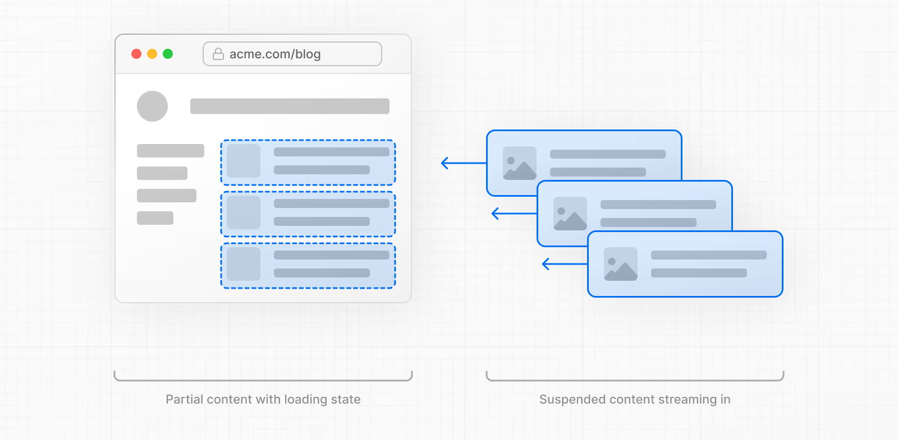
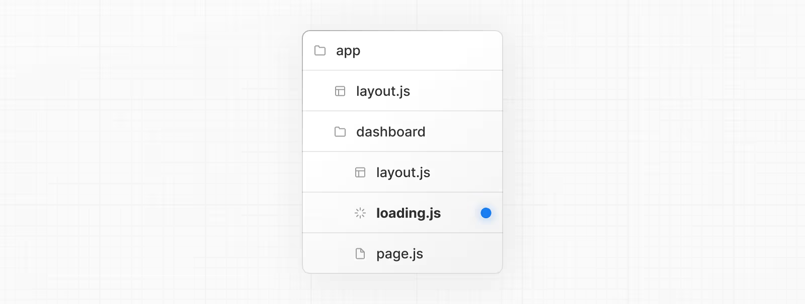

# Bağlantı ve Gezinme

Next.js’te rotalar varsayılan olarak sunucuda işlenir. Bu genellikle istemcinin yeni bir rota gösterilmeden önce sunucu yanıtını beklemesi gerektiği anlamına gelir. Next.js, dahili önyükleme (prefetching), akış (streaming) ve istemci tarafı geçişlerle (client-side transitions) birlikte gelir; böylece gezinmenin hızlı ve duyarlı kalmasını sağlar.

Bu kılavuz, Next.js’te gezinmenin nasıl çalıştığını ve bunu dinamik rotalar ile yavaş ağlar için nasıl optimize edebileceğinizi açıklar.

## Gezinme nasıl çalışır?

Next.js’te gezinmenin nasıl çalıştığını anlamak için şu kavramlara aşina olmak faydalıdır:

* **Sunucu Tarafı İşleme (Server Rendering)**
* **Önyükleme (Prefetching)**
* **Akış (Streaming)**
* **İstemci tarafı geçişler (Client-side transitions)**

### Sunucu Tarafı İşleme

Next.js’te **Layout** ve **Page** bileşenleri varsayılan olarak **React Server Components**’tır. İlk ve sonraki gezinmelerde, **Server Component Payload** sunucuda oluşturulur ve istemciye gönderilmeden önce hazırlanır.

Sunucu tarafı işlemenin iki türü vardır, gerçekleştiği zamana göre:

* **Statik İşleme (Static Rendering / Prerendering):** Derleme sırasında veya yeniden doğrulama (revalidation) sırasında gerçekleşir ve sonuç önbelleğe alınır.
* **Dinamik İşleme (Dynamic Rendering):** İstemciden gelen bir isteğe yanıt olarak anlık çalışır.

Sunucu tarafı işlemenin dezavantajı, istemcinin yeni rota gösterilmeden önce sunucudan yanıt beklemek zorunda olmasıdır. Next.js bu gecikmeyi, kullanıcının ziyaret etme olasılığı yüksek olan rotaları önceden yükleyerek (prefetching) ve istemci tarafında geçişler yaparak çözer.

> **Bilmekte Fayda Var:** İlk ziyaret için HTML de oluşturulur.

---

### Önyükleme (Prefetching)

**Önyükleme**, kullanıcının henüz geçiş yapmadığı bir rotanın arka planda yüklenmesidir. Bu sayede uygulamanızda rotalar arası geçişler anında gerçekleşiyormuş gibi hissedilir; çünkü kullanıcı bağlantıya tıkladığında bir sonraki rotayı oluşturmak için gereken veri zaten istemci tarafında hazırdır.

Next.js, `Link` bileşeni ile bağlanan rotaları kullanıcı görünümüne (viewport) girdiğinde otomatik olarak önyükler.

```tsx
// app/layout.tsx
import Link from 'next/link'
 
export default function Layout({ children }: { children: React.ReactNode }) {
  return (
    <html>
      <body>
        <nav>
          {/* Bağlantı üzerine gelindiğinde veya görünüm alanına girdiğinde önceden yüklenir */}
          <Link href="/blog">Blog</Link>
          {/* Önyükleme yapılmaz */}
          <a href="/contact">Contact</a>
        </nav>
        {children}
      </body>
    </html>
  )
}
```

Bir rotanın ne kadarının önyükleneceği statik veya dinamik olmasına bağlıdır:

* **Statik Rota:** Rota tamamen önyüklenir.
* **Dinamik Rota:** Önyükleme atlanır veya `loading.tsx` dosyası varsa rota kısmen önyüklenir.

Dinamik rotaların önyüklemesini atlayarak veya kısmen yaparak Next.js, kullanıcıların hiç ziyaret etmeyeceği rotalar için gereksiz sunucu yükünden kaçınır. Ancak, gezinmeden önce sunucu yanıtını beklemek kullanıcıya uygulamanın yanıt vermediği izlenimi verebilir.


## Gezinme deneyimini geliştirmek için: Akış (Streaming)

Dinamik rotalarda gezinme deneyimini iyileştirmek için **akış (streaming)** kullanabilirsiniz.

### Akış (Streaming)

Akış, sunucunun dinamik bir rotanın tümü oluşturulana kadar beklemek yerine, hazır olan parçalarını hemen istemciye göndermesine olanak tanır. Bu, sayfanın bazı bölümleri hâlâ yükleniyor olsa bile, kullanıcıların daha erken bir şeyler görmesini sağlar.

Dinamik rotalar için bu, rotaların kısmen önyüklenebileceği anlamına gelir. Yani, paylaşılan layout’lar ve yükleme iskeletleri (loading skeletons) önceden istenebilir.




Akışı kullanmak için, rota klasörünüzün içine bir loading.tsx dosyası oluşturun:




## app/dashboard/loading.tsx

TypeScript

```tsx
export default function Loading() {
  // Rota yüklenirken gösterilecek geri dönüş (fallback) arayüzü ekleyin.
  return <LoadingSkeleton />
}
```

Arka planda, Next.js `page.tsx` içeriğini otomatik olarak bir **`<Suspense>`** sınırı ile sarmalar. Önyüklenen fallback arayüz rota yüklenirken gösterilir ve hazır olduğunda gerçek içerikle değiştirilir.

> **Bilmekte fayda var:** Ayrıca **`<Suspense>`** bileşenini iç içe geçmiş bileşenler için yükleme arayüzü oluşturmak amacıyla da kullanabilirsiniz.

---

### `loading.tsx` kullanmanın avantajları:

* Kullanıcı için anında gezinme ve görsel geri bildirim.
* Paylaşılan layout’lar etkileşimli kalır ve gezinme kesilebilir.
* **Core Web Vitals** metriklerinde iyileşme: TTFB, FCP ve TTI.

Gezinme deneyimini daha da iyileştirmek için, Next.js `Link` bileşeni ile istemci tarafı geçişler yapar.

---

## İstemci tarafı geçişler (Client-side transitions)

Geleneksel olarak, sunucuda işlenen bir sayfaya yapılan gezinme tam sayfa yeniden yüklemesi tetikler. Bu, durumu sıfırlar, kaydırma konumunu resetler ve etkileşimi engeller.

Next.js bunu **`<Link>` bileşeni** ile istemci tarafı geçişler yaparak önler. Sayfa yeniden yüklenmek yerine içerik dinamik olarak güncellenir:

* Paylaşılan layout ve arayüzler korunur.
* Mevcut sayfa, önyüklenmiş yükleme durumu veya mevcutsa yeni sayfa ile değiştirilir.

İstemci tarafı geçişler, sunucuda işlenen uygulamaların istemcide işlenmiş gibi hissettirmesini sağlar. Önyükleme ve akış ile birleştiğinde, dinamik rotalar için bile hızlı geçişler sunar.

---

## Geçişleri yavaşlatan ne olabilir?

Next.js optimizasyonları gezinmeyi hızlı ve duyarlı hale getirir. Ancak bazı durumlarda geçişler hâlâ yavaş hissedilebilir. İşte yaygın nedenler ve çözümler:

### `loading.tsx` olmadan dinamik rotalar

Dinamik bir rotaya geçiş yaparken istemcinin sonucu göstermeden önce sunucu yanıtını beklemesi gerekir. Bu, uygulamanın yanıt vermediği izlenimi verebilir.

Dinamik rotalara **`loading.tsx`** eklemenizi öneririz; bu sayede kısmi önyükleme yapılır, anında gezinme tetiklenir ve rota işlenirken yükleme arayüzü gösterilir.

```tsx
// app/blog/[slug]/loading.tsx
export default function Loading() {
  return <LoadingSkeleton />
}
```

> **Bilmekte fayda var:** Geliştirme modunda, rotanın statik mi dinamik mi olduğunu görmek için **Next.js Devtools**’u kullanabilirsiniz. Daha fazla bilgi için `devIndicators` bölümüne bakın.

---

### `generateStaticParams` olmadan dinamik segmentler

Statik olarak işlenebilecek bir dinamik segmentte `generateStaticParams` eksikse, rota istem anında dinamik olarak işlenmeye geri döner.

Rotanın derleme sırasında statik olarak oluşturulduğundan emin olmak için `generateStaticParams` ekleyin:

```tsx
// app/blog/[slug]/page.tsx
export async function generateStaticParams() {
  const posts = await fetch('https://.../posts').then((res) => res.json())
 
  return posts.map((post) => ({
    slug: post.slug,
  }))
}
 
export default async function Page({
  params,
}: {
  params: Promise<{ slug: string }>
}) {
  const { slug } = await params
  // ...
}
```

---

### Yavaş ağlar

Yavaş veya dengesiz ağlarda, önyükleme kullanıcı tıklamadan önce tamamlanamayabilir. Bu hem statik hem dinamik rotaları etkiler. Bu durumlarda, `loading.js` fallback hemen görünmeyebilir çünkü henüz önyüklenmemiştir.

Algılanan performansı artırmak için, kullanıcıya gezinme sırasında satır içi görsel geri bildirim göstermek amacıyla **`useLinkStatus`** kancasını kullanabilirsiniz (ör. bağlantıda dönen ikon veya parlayan metin).

```tsx
// app/ui/loading-indicator.tsx
'use client'
 
import { useLinkStatus } from 'next/link'
 
export default function LoadingIndicator() {
  const { pending } = useLinkStatus()
  return pending ? (
    <div role="status" aria-label="Loading" className="spinner" />
  ) : null
}
```

Yükleme göstergesini “debounce” edebilirsiniz; yani başlangıçta kısa bir animasyon gecikmesi (ör. 100ms) ekleyip ilk başta görünmez (opacity: 0) başlatabilirsiniz. Böylece gösterge yalnızca gezinme belirtilen süreden uzun sürdüğünde görünür.

```css
.spinner {
  /* ... */
  opacity: 0;
  animation:
    fadeIn 500ms 100ms forwards,
    rotate 1s linear infinite;
}
 
@keyframes fadeIn {
  from {
    opacity: 0;
  }
  to {
    opacity: 1;
  }
}
 
@keyframes rotate {
  to {
    transform: rotate(360deg);
  }
}
```

> **Bilmekte fayda var:** İlerleme çubuğu gibi başka görsel geri bildirim desenleri de kullanabilirsiniz.

---

### Önyüklemeyi devre dışı bırakma

`<Link>` bileşeninde `prefetch` özelliğini `false` yaparak önyüklemeyi devre dışı bırakabilirsiniz. Bu, özellikle çok büyük bağlantı listeleri (ör. sonsuz kaydırmalı tablo) oluştururken gereksiz kaynak kullanımını önlemek için yararlıdır.

```tsx
<Link prefetch={false} href="/blog">
  Blog
</Link>
```

Ancak önyüklemeyi devre dışı bırakmanın bazı dezavantajları vardır:

* Statik rotalar yalnızca kullanıcı bağlantıya tıkladığında alınır.
* Dinamik rotalar için istemci geçiş yapmadan önce sunucuda işlenmesi gerekir.

Kaynak kullanımını tamamen devre dışı bırakmadan azaltmak için, yalnızca **hover** üzerinde önyükleme yapabilirsiniz. Böylece yalnızca kullanıcının ziyaret etme olasılığı yüksek olan rotalar önyüklenir.

```tsx
// app/ui/hover-prefetch-link.tsx
'use client'
 
import Link from 'next/link'
import { useState } from 'react'
 
function HoverPrefetchLink({
  href,
  children,
}: {
  href: string
  children: React.ReactNode
}) {
  const [active, setActive] = useState(false)
 
  return (
    <Link
      href={href}
      prefetch={active ? null : false}
      onMouseEnter={() => setActive(true)}
    >
      {children}
    </Link>
  )
}
```

---

### Hydration tamamlanmadı

`<Link>` bir **Client Component**’tir ve önyükleme yapabilmesi için hydrate edilmesi gerekir. İlk ziyarette, büyük JavaScript paketleri hydration’ı geciktirebilir, bu da önyüklemenin hemen başlamasını engeller.

React bunu **Selective Hydration** ile azaltır. Siz de şu yöntemlerle daha fazla iyileştirme yapabilirsiniz:

* **`@next/bundle-analyzer`** eklentisini kullanarak büyük bağımlılıkları kaldırıp paket boyutunu azaltın.
* Mümkün olduğunda mantığı istemciden sunucuya taşıyın. Bunun için **Server ve Client Components** belgelerine bakın.

---

## Örnekler

### Native History API

Next.js, sayfayı yeniden yüklemeden tarayıcı geçmişini güncellemek için yerleşik **`window.history.pushState`** ve **`window.history.replaceState`** yöntemlerini kullanmanıza izin verir.

Bu çağrılar Next.js Router ile entegre olur ve `usePathname` ve `useSearchParams` ile senkronize olmanızı sağlar.

#### `window.history.pushState`

Geçmiş yığınına yeni bir giriş ekler. Kullanıcı geri butonuyla önceki duruma dönebilir. Örneğin, ürün listesini sıralamak için:

```tsx
'use client'
 
import { useSearchParams } from 'next/navigation'
 
export default function SortProducts() {
  const searchParams = useSearchParams()
 
  function updateSorting(sortOrder: string) {
    const params = new URLSearchParams(searchParams.toString())
    params.set('sort', sortOrder)
    window.history.pushState(null, '', `?${params.toString()}`)
  }
 
  return (
    <>
      <button onClick={() => updateSorting('asc')}>Sort Ascending</button>
      <button onClick={() => updateSorting('desc')}>Sort Descending</button>
    </>
  )
}
```

#### `window.history.replaceState`

Mevcut girişin üzerine yazar. Kullanıcı geri butonuyla önceki duruma dönemez. Örneğin, uygulamanın dilini değiştirmek için:

```tsx
'use client'
 
import { usePathname } from 'next/navigation'
 
export function LocaleSwitcher() {
  const pathname = usePathname()
 
  function switchLocale(locale: string) {
    // örn. '/en/about' veya '/fr/contact'
    const newPath = `/${locale}${pathname}`
    window.history.replaceState(null, '', newPath)
  }
 
  return (
    <>
      <button onClick={() => switchLocale('en')}>English</button>
      <button onClick={() => switchLocale('fr')}>French</button>
    </>
  )
}
```

---

## Sonraki Adımlar

* **Link Component**
  Dahili `next/link` bileşeni ile hızlı istemci tarafı gezinmeyi etkinleştirin.

* **loading.js**
  `loading.js` dosyası için API referansı.

* **Prefetching**
  Next.js’te önyüklemeyi nasıl yapılandıracağınızı öğrenin.

